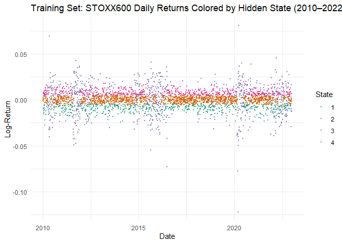

# Extending Hidden Markov Models with Skew-Normal Emissions: A Framework for Market Regime Identification and Risk Management

## Abstract

This project develops a regime-switching framework for modeling
financial market dynamics by applying a Hidden Markov Model (HMM) with
skew-normal emission distributions to the daily log-returns of the STOXX
Europe 600 index over the period 2010–2025. By capturing both volatility
clustering and asymmetric return distributions, the model offers a more
realistic alternative to standard Gaussian-based approaches and
effectively characterizes the non-linear behavior of equity markets.

Model selection based on Akaike (AIC) and Bayesian (BIC) Information
Criteria identifies a four-state specification as the most parsimonious
and informative. Each regime displays distinct statistical features: a
persistent bearish regime with moderate volatility (State 1), a
low-volatility consolidation phase (State 2), a high-volatility crisis
regime (State 3), and a stable bullish regime with low volatility and
positive returns (State 4). These latent states are estimated using a
modified forward algorithm and interpreted based on their location,
scale, and skewness parameters.

Building on these insights, two regime-aware risk management strategies
are developed and evaluated out-of-sample (2023–2025):

- A pure regime-based strategy, which avoids market exposure during
  high-risk regimes (States 1 and 3), conditional on filtered state
  probabilities exceeding a 40% threshold;
- An enhanced hybrid strategy, which further filters exposure using a
  historical 99% Value-at-Risk (VaR) condition to dynamically adapt to
  extreme tail risk.

The regime-only strategy yields a 27.74% return with a Sharpe ratio of
1.14, while the hybrid approach improves both metrics to 29.59% and
1.51, respectively. Both outperform the benchmark (23.40%, 0.70) and
reduce drawdown to nearly half the benchmark level.

To assess tail risk under extreme conditions, the study complements the
HMM-based analysis with Extreme Value Theory (EVT). Using a
Peaks-Over-Threshold (POT) approach with the Generalised Pareto
Distribution (GPD), both raw and declustered exceedances are modeled to
estimate 99% VaR. These EVT-based estimates are then compared with the
regime-based VaR derived from skew-normal simulations under the HMM.

While EVT excels in modeling rare extremes without strong assumptions on
the data’s bulk, the HMM-based approach offers a dynamic,
distribution-aware alternative that captures both volatility and
asymmetry across regimes. The triangulation between EVT and HMM-based
VaR enhances robustness in risk estimation and directly informs the
hybrid risk management strategy.

Overall, the results demonstrate the operational value of combining
latent regime detection with extreme tail modeling to build
risk-sensitive investment strategies. The hybrid approach is
particularly effective in balancing downside protection with upside
participation, offering a robust framework for real-world portfolio
management under regime uncertainty and fat-tailed risk.

------------------------------------------------------------------------

## 1. Introduction

## Introduction

Financial markets alternate between phases of stability, turbulence,
growth, and contraction. These regime shifts, while often driven by
macroeconomic trends, investor sentiment, or systemic shocks, are not
directly observable in asset return data. To uncover such latent
structure, Hidden Markov Models (HMMs) provide a powerful and flexible
framework for modeling unobservable market states and the probabilistic
transitions between them.

An HMM assumes that the observed time series, such as stock or index
returns, is generated by an underlying process that moves between a
finite set of hidden regimes. Each regime is characterized by a distinct
distribution of returns, while regime transitions follow a Markov
process, meaning that the probability of moving to the next state
depends only on the current one.

Traditionally, the regime-dependent distributions in HMMs have been
modeled using Gaussian densities. However, empirical financial returns
frequently exhibit skewness and fat tails, especially during periods of
elevated volatility or crisis. To address these stylized features, this
study extends the classical HMM by adopting **skew-normal emission
distributions**, allowing each regime to have its own location, scale,
and skewness parameters. This extension enables the model to better
capture asymmetric market behavior and extreme observations.

This work applies a Hidden Markov Model with skew-normal emissions to
the **daily returns of the STOXX Europe 600 index over the period
2010–2025**. The goals of the study are:

- To estimate HMMs with one to four regimes and select the best model
  using the Akaike and Bayesian Information Criteria;
- To interpret each identified regime in economic terms (e.g., crisis,
  stable bull, recovery);
- To assess tail risk using Extreme Value Theory (EVT), estimating the
  99% Value-at-Risk with Generalised Pareto Distributions (GPD), and
  compare it with regime-implied VaR from the HMM;
- To apply the selected model out-of-sample to the 2023–2025 period and
  build regime-aware risk management strategies;

The model is implemented in R, using the `sn` package to handle
skew-normal distributions. The standard forward algorithm is modified
accordingly for likelihood evaluation and real-time filtering.

In summary, this project combines robust probabilistic modeling with a
practical regime-based trading application. It highlights how latent
state inference can support adaptive investment decisions and improve
risk management in the presence of nonlinear market dynamics.

------------------------------------------------------------------------

## 2. Background Theory

### 2.1 The Skew-Normal Distribution

The **skew-normal distribution** is a generalization of the normal
distribution that incorporates skewness. Introduced by Azzalini (1985),
it is particularly useful in modeling financial data that deviates from
symmetry, especially during periods of extreme market movement.

The probability density function (PDF) of a skew-normal distribution is
given by:

$$
f(x; \xi, \omega, \alpha) = \frac{2}{\omega} \, \phi\left(\frac{x - \xi}{\omega}\right) \, \Phi\left(\alpha \cdot \frac{x - \xi}{\omega}\right)
$$

Where:

- $\xi \in \mathbb{R}$ is the **location parameter** (analogous to the
  mean).

- $\omega > 0$ is the **scale parameter** (analogous to the standard
  deviation).

- $\alpha \in \mathbb{R}$ is the **skewness parameter** which determines
  the asymmetry of the distribution, indicating whether the data tend to
  have a longer tail on one side.

- $\phi(\cdot)$ is the standard normal density.

- $\Phi(\cdot)$ is the standard normal cumulative distribution function.

Some important properties:

1.  When $\alpha = 0$, the skew-normal reduces to the **standard normal
    distribution**.

2.  Positive $\alpha$ implies **right skewness**, and negative $\alpha$
    implies **left skewness**.

3.  The distribution can model **asymmetry** in asset returns, which is
    common in financial data.

The `sn` package in R is employed to work with the skew-normal
distribution, providing the function `dsn()` for evaluating the
corresponding probability density function.

### 2.2 Hidden Markov Models (HMMs)

Hidden Markov Models (HMMs) are powerful tools for modeling time series
that exhibit unobservable structural changes over time, such as shifts
in volatility or returns in financial markets. They describe a process
governed by a sequence of hidden states that influence the behavior of
observed data. The key idea is that the observed series is generated
from a set of regime-specific distributions, while the regimes
themselves evolve stochastically according to a Markov chain.

#### 2.2.1 Model structure

An HMM consists of two interconnected stochastic processes: a **hidden
state process** $\{C_t\}_{t=1}^T$, and an **observable process**
$\{X_t\}_{t=1}^T$. The hidden process takes values in a finite set of
$m$ regimes and follows a first-order, time-homogeneous Markov chain.
The observed process consists of real-valued variables, where each $X_t$
is conditionally independent of the past given the current hidden state
$C_t$.

Formally, the model is defined by:

- A set of hidden states $C_t \in \{1, ..., m\}$;
- An initial distribution $\delta = (\delta_1, ..., \delta_m)$, where
  $\delta_j = P(C_1 = j)$;
- A transition matrix $\Gamma = (\gamma_{ij})$, where
  $\gamma_{ij} = P(C_t = j \mid C_{t-1} = i)$ and
  $\sum_{j=1}^m \gamma_{ij} = 1$ for all $i$;
- A set of emission densities $f_j(x)$, such that
  $X_t \mid C_t = j \sim f_j(x)$.

In our setting, each $f_j(x)$ is assumed to follow a **skew-normal
distribution** with:

- location parameter $\xi_j \in \mathbb{R}$,
- scale parameter $\omega_j > 0$,
- skewness parameter $\alpha_j \in \mathbb{R}$.

Under these assumptions, the **joint distribution** of the full sequence
of observations and hidden states can be factorized as:

$$
P(X_{1:T}, C_{1:T}) = \delta_{C_1} f_{C_1}(x_1) \prod_{t=2}^{T} \gamma_{C_{t-1}, C_t} f_{C_t}(x_t)
$$

#### 2.2.2 Forward algorithm and likelihood

To compute the likelihood of the observed data, summing over all
possible sequences of hidden states is computationally infeasible due to
exponential complexity in $T$. Instead, we use the **forward
algorithm**, which recursively computes the likelihood via **forward
probabilities**:

$$
\alpha_t(j) = P(X_{1:t}, C_t = j)
$$

This is interpreted as the joint probability of observing the data up to
time $t$ and being in state $j$ at time $t$.

The recursion is:

- **Initialization**: $$
  \alpha_1(j) = \delta_j \cdot f_j(x_1)
  $$

- **Induction** (for $t = 2, ..., T$): $$
  \alpha_t(j) = \sum_{i=1}^m \alpha_{t-1}(i) \cdot \gamma_{ij} \cdot f_j(x_t)
  $$

- **Termination (total likelihood)**: $$
  \mathcal{L}(\theta) = \sum_{j=1}^m \alpha_T(j), \quad \log \mathcal{L}(\theta) = \log\left( \sum_{j=1}^m \alpha_T(j) \right)
  $$

The emission densities $f_j(x_t)$ are evaluated using the `dsn()`
function from the `sn` package in R. The parameter vector
$\theta = (\Gamma, \xi_j, \omega_j, \alpha_j)$ is estimated by
maximizing the log-likelihood using the **L-BFGS-B** algorithm, a
constrained quasi-Newton optimization method suitable for large-scale
problems.

#### 2.2.3 Filtering and prediction

Once the forward probabilities are computed, the **filtered
probabilities**, the posterior distribution of the hidden state at time
$t$, can be derived by normalization:

$$
P(C_t = j \mid X_{1:t}) = \frac{\alpha_t(j)}{\sum_{k=1}^m \alpha_t(k)}
$$

These probabilities offer a real-time estimate of the system’s hidden
state and are used to detect and act on regime shifts in our trading
strategy.

We can also compute the **one-step-ahead predictive distribution** of
the next regime:

$$
P(C_{t+1} = j \mid X_{1:t}) = \sum_{i=1}^m P(C_t = i \mid X_{1:t}) \cdot \gamma_{ij}
$$

This predictive step gives the probability of transitioning to each
possible state at $t+1$, based on all current information.

#### 2.2.4 Remarks

Although the **EM algorithm** (e.g., Baum–Welch) is widely used for
estimating Hidden Markov Models with tractable emission distributions,
it is not applied in this project. The skew-normal distribution, while
flexible in capturing asymmetry, does not yield closed-form solutions
for the M-step updates required by EM. To address this, we estimate the
model parameters by directly maximizing the observed-data log-likelihood
using the L-BFGS-B optimization algorithm.

This direct likelihood approach enables simultaneous estimation of both
the transition matrix and regime-specific parameters, without relying on
intermediate expectation steps. Beyond its suitability for skew-normal
emissions, this method also offers greater flexibility for incorporating
more complex distributional assumptions, parameter constraints, or
regularization schemes—making it a robust framework for modeling latent
dynamics in financial time series.

------------------------------------------------------------------------

## 3. Data

### 3.1 Source and Description

The dataset under analysis consists of daily closing prices of the
**STOXX Europe 600 index**, a comprehensive benchmark comprising large,
mid, and small-capitalization companies from 17 European countries. The
observation period spans from **January 2010 to June 2025**. Data are
retrieved using the `get.hist.quote()` function from the `tseries`
package in R.

The `"AdjClose"` column is used to compute **daily log-returns**, which
are widely employed in financial time series modeling due to their
properties of additivity and approximate stationarity.

``` r
# Load required libraries
library(tidyverse)      
library(tseries)
library(xts)
library(sn)
library(e1071)
library(PerformanceAnalytics)
library(scales)
library(patchwork)
library(ggplot2)
library(ggthemes)
library(sn)
library(tibble)
library(moments)
library(dplyr)
library(xtable)
library(ismev)
library(evd)
library(reshape2)
library(scales)
library(gridExtra)


# Download STOXX600 data
sx600 <- get.hist.quote(instrument = "^stoxx", 
                       start = "2010-01-01", 
                       end = "2025-06-24", 
                       quote = "AdjClose")
```

    ## time series starts 2010-01-04
    ## time series ends   2025-06-23

``` r
# Compute daily log-returns and create xts object
sx600.ret <- diff(log(as.numeric(sx600)))
dates <- index(sx600)[-1]
sx600.ret <- xts(sx600.ret, order.by = dates)
colnames(sx600.ret) <- "log_returns"
```

### 3.2 Data Inspection

A visual inspection of the data is conducted to identify potential
anomalies, missing values, or extreme outliers.

``` r
# Create data frames for prices and returns
df_prices <- tibble(
  Date = index(sx600),
  Price = as.numeric(sx600)
)

df_returns <- tibble(
  Date = index(sx600.ret),
  LogReturn = as.numeric(sx600.ret)
)

# Define custom theme for consistency
custom_theme <- theme_minimal(base_size = 12) +
  theme(
    axis.title.x = element_blank(),
    axis.title.y = element_blank(),
    axis.text.x = element_text(angle = 45, hjust = 1),
    panel.grid.minor = element_blank()
  )

# Create plots
plot_prices <- ggplot(df_prices, aes(x = Date, y = Price)) +
  geom_line(color = "darkblue", linewidth = 0.5) +
  labs(title = "STOXX600 Adjusted Closing Prices (2010–2025)") +
  scale_x_date(date_breaks = "1 year", date_labels = "%Y") +
  custom_theme

plot_returns <- ggplot(df_returns, aes(x = Date, y = LogReturn)) +
  geom_line(color = "steelblue", linewidth = 0.3) +
  labs(title = "STOXX600 Daily Log-Returns (2010–2025)") +
  scale_x_date(date_breaks = "1 year", date_labels = "%Y") +
  custom_theme

# Display plots side by side using patchwork
plot_prices 
```

<!-- -->

``` r
plot_returns
```

<!-- -->

To enable a rigorous out-of-sample evaluation of both distributional
properties and trading performance, the dataset is partitioned into a
**training set (2010–2022)** and a **test set (2023–2025)**.

``` r
# Clean data and prepare train-test split
sx600.ret.clean <- na.omit(sx600.ret)
dates_full <- index(sx600.ret.clean)
returns_full <- as.numeric(sx600.ret.clean$log_returns)

# Define split dates
train_end <- as.Date("2022-12-31")
test_start <- as.Date("2023-01-01")

# Create indices and split data
train_idx <- which(dates_full <= train_end)
test_idx <- which(dates_full >= test_start)

# Split returns and dates
returns_train <- returns_full[train_idx]
returns_test <- returns_full[test_idx]
dates_train <- dates_full[train_idx]
dates_test <- dates_full[test_idx]

# Create training data frame
df_train <- tibble(LogReturn = returns_train)
```

This structure supports a two-step analysis: first, characterizing the
unconditional distribution of returns within the training period;
second, validating model-driven strategies on unseen data. The following
analysis focuses on the training set to assess the adequacy of the
skew-normal assumption and to motivate the use of a regime-switching
framework.

### 3.3 Observations

The time series plots of the STOXX Europe 600 index, presented in the
previous section, reveal clear patterns of changing dynamics over time.
Notably, the periods around early 2020 and mid-2022 exhibit marked
increases in volatility, likely corresponding to major macroeconomic
events such as the COVID-19 outbreak and subsequent inflationary shocks.
These episodes suggest the presence of structural breaks or underlying
regime shifts in the data-generating process. Additionally, the presence
of occasional large negative returns provides visual evidence of
asymmetry, particularly in the left tail of the distribution, consistent
with the notion of **negative skewness**.

These empirical features motivate the application of a **Hidden Markov
Model (HMM)** with **skew-normal emission distributions**, which allows
for both latent regime switching and the flexibility to model
non-symmetric return behavior. Before proceeding to model estimation, it
is essential to examine the unconditional distribution of returns and
compare its shape to the Gaussian and skew-normal assumptions.

``` r
# Fit skew-normal distribution
fit_sn <- selm(LogReturn ~ 1, data = df_train)
dp <- coef(fit_sn, "DP")

# Calcolo skewness
alpha <- dp["alpha"]
delta <- alpha / sqrt(1 + alpha^2)
skew_implied <- ((4 - pi)/2) * (delta^3) / ((1 - 2*delta^2/pi)^(3/2))
skew_empirical <- skewness(df_train$LogReturn)

# Costruisci la tabella
params_table <- tibble(
  State = 1,
  Location = dp["xi"],
  Scale = dp["omega"],
  Alpha = alpha,
  Skewness_Implied = skew_implied,
  Skewness_Empirical = skew_empirical
)

# Stampa tabella con xtable
xtable_obj <- xtable(params_table,
                     caption = "Skew-Normal Distribution Parameters",
                     align = c("l", "c", "c", "c", "c", "c", "c"),
                     digits = c(0, 4, 4, 4, 4, 4, 4))  # Specificare digits per ogni colonna

print(xtable_obj,
      include.rownames = FALSE,
      comment = FALSE,
      caption.placement = "top",
      floating = TRUE,
      booktabs = TRUE)
```

``` r
# Plot density comparison
ggplot(df_train, aes(x = LogReturn)) +
  geom_histogram(aes(y = ..density..), bins = 50,
                fill = "lightgrey", color = "black") +
  geom_density(color = "blue", size = 1, alpha = 0.7) +
  stat_function(
    fun = function(x) dsn(x, xi = dp["xi"], omega = dp["omega"], 
                         alpha = dp["alpha"]),
    color = "red", size = 1
  ) +
  stat_function(
    fun = function(x) dnorm(x, mean = mean(df_train$LogReturn),
                           sd = sd(df_train$LogReturn)),
    color = "darkgreen", linetype = "dashed", size = 1
  ) +
  labs(title = "STOXX600 Log-Returns: Empirical vs. Fitted Densities") +
  custom_theme
```

<!-- -->

The distributional properties of the STOXX Europe 600 daily log-returns
are first explored using histogram-based visualizations and quantitative
skewness measures. In addition to the histogram, three overlaid density
curves are provided:

- A **kernel density estimate**, serving as a non-parametric benchmark;
- A **normal distribution fit**, assuming symmetry in returns;
- A **skew-normal distribution fit**, estimated via maximum likelihood
  using the `selm()` function from the `sn` package.

This setup allows for a visual and statistical comparison of how well
the skew-normal distribution captures the empirical features of the
data, particularly in terms of asymmetry and tail behavior.

The best fit of the skew-normal distribution is not immediately evident
from the histogram, but it is suggested by the **empirical skewness**
estimated from the kernel density, which is −0.7533. In contrast, the
**skewness implied by the best-fitting skew-normal distribution**, based
on a skewness parameter of $\alpha = -1.2490$, is only −0.4264.

This gap indicates that, while the skew-normal model improves upon the
symmetric Gaussian assumption, it still underestimates the left-tail
risk and return asymmetry.

Such a structural limitation in modeling the entire return distribution
with a single skew-normal component motivates the adoption of a
regime-switching framework, where each latent market state may exhibit
distinct volatility, mean, and skewness. The following section
formalizes this approach through a Hidden Markov Model with skew-normal
emissions.

------------------------------------------------------------------------

## 4. HMM Model with Skew-Normal Distribution

### 4.1 Forward Algorithm with Skew-Normal Emissions

To compute the log-likelihood of a Hidden Markov Model (HMM) with
skew-normal emissions, the standard **Forward algorithm** is modified by
replacing the Gaussian density with a **skew-normal density function.**

The recursion for the forward probabilities is:

$$
\alpha_t(j) = \sum_{i=1}^m \alpha_{t-1}(i) \cdot \gamma_{ij} \cdot f_j(x_t)
$$

Where:

- $m$: number of hidden states

- $f_j(x_t)$ is the skew-normal PDF evaluated using:

$$
f_j(x_t) = \frac{2}{\omega_j} \, \phi\left(\frac{x_t - \xi_j}{\omega_j}\right) \, \Phi\left(\alpha_j \cdot \frac{x_t - \xi_j}{\omega_j}\right)
$$

The `dsn()` function from the `sn` package is used to evaluate the
skew-normal density within the modified Forward algorithm.

``` r
#' Forward Algorithm for Skew-Normal HMM
#' @param delta Initial state distribution
#' @param gamma Transition matrix
#' @param xi Location parameters
#' @param omega Scale parameters
#' @param alpha Shape parameters
#' @param data Observed data
forward_skew <- function(delta, gamma, xi, omega, alpha, data) {
  m <- length(delta)
  T <- length(data)
  
  # Initialize matrices
  pred <- matrix(NA, nrow = m, ncol = T)
  filtering <- matrix(NA, nrow = m, ncol = T)
  
  # Initial state
  pred[, 1] <- delta
  filtering[, 1] <- pred[, 1] * dsn(x = data[1], xi = xi, 
                                   omega = omega, alpha = alpha)
  loglik <- log(sum(filtering[, 1]))
  filtering[, 1] <- filtering[, 1] / sum(filtering[, 1])
  
  # Forward recursion
  for (t in 2:T) {
    pred[, t] <- as.vector(t(filtering[, t - 1]) %*% gamma)
    filtering[, t] <- pred[, t] * dsn(x = data[t], xi = xi, 
                                     omega = omega, alpha = alpha)
    loglik <- loglik + log(sum(filtering[, t]))
    filtering[, t] <- filtering[, t] / sum(filtering[, t])
  }
  
  return(list(loglik = loglik, filtering = filtering, pred = pred))
}
```

### 4.2 Log-Likelihood Function

The total log-likelihood is computed using the normalizing constants
from the forward algorithm:

$$
\log L = \log \left( \sum_{j=1}^{m} \alpha_1(j) \right) + \sum_{t=2}^{T} \log \left( \sum_{j=1}^{m} \alpha_t(j) \right)
$$

The following function is used to evaluate the log-likelihood of the
observed data under a specified Hidden Markov Model with skew-normal
emissions. It performs the following operations:

- Constructs the transition probability matrix $\Gamma$ from the
  flattened parameter vector.
- Extracts the skew-normal parameters $(\xi_j, \omega_j, \alpha_j)$ for
  each hidden state.
- Computes the stationary distribution $\delta$ associated with
  $\Gamma$.
- Calls the `forward_skew()` function to compute the overall
  log-likelihood of the model.

``` r
#' Log-likelihood function for Skew-Normal HMM
#' @param par Parameter vector
#' @param m Number of states
#' @param data Observed data
loglik_skewHMM <- function(par, m, data) {
  # Extract parameters
  gamma <- matrix(par[1:(m^2)], nrow = m, byrow = TRUE)
  gamma <- gamma / rowSums(gamma)  # normalize rows
  
  start <- m^2 + 1
  xi <- par[start:(start + m - 1)]
  omega <- par[(start + m):(start + 2 * m - 1)]
  alpha <- par[(start + 2 * m):(start + 3 * m - 1)]
  
  # Calculate stationary distribution
  I <- diag(m)
  U <- matrix(1, m, m)
  delta <- solve(t(I - gamma + U), rep(1, m))
  
  # Compute log-likelihood
  out <- forward_skew(delta, gamma, xi, omega, alpha, data)
  return(out$loglik)
}
```

### 4.3 Parameter Structure

For a model with $m$ hidden states, the total number of parameters $k$
is:

$$
k =m^2 +3m
$$

- $m^2$ transition probabilities (flattened into a vector, then
  normalized).

- $m$ location parameters $\xi$.

- $m$ scale parameters $\omega$.

- $m$ skewness parameters $\alpha$.

These parameters are combined into a single vector and passed to the
optimization routine. Bounds are applied to ensure $\omega_j > 0$
(positive scale), while $\xi_j$ and $\alpha_j$ are unconstrained.

In the subsequent chapter, this function is incorporated within the
`optim()` optimization routine to estimate model parameters for varying
numbers of hidden states ($m$). For each specification, both the
**Akaike Information Criterion (AIC)** and the **Bayesian Information
Criterion (BIC)** are computed to identify the model that best balances
goodness of fit and model complexity.

------------------------------------------------------------------------

## 5. Model Estimation

### 5.1 Overview

To determine the most appropriate number of hidden regimes, Hidden
Markov Models with skew-normal emissions are estimated for different
values of $m$, ranging from 1 to 4 hidden states. For each
specification, the log-likelihood is maximized using the `optim()`
function in R.

Model selection is conducted using both the **Akaike Information
Criterion (AIC)** and the **Bayesian Information Criterion (BIC)**,
which provide a trade-off between model fit and complexity. These are
computed as follows:

$$
\text{AIC} = 2k - 2 \log L
$$

$$
\text{BIC} = \log(T) \cdot k - 2 \log L
$$

where $k$ denotes the total number of estimated parameters, $\log L$ is
the maximized log-likelihood of the model, and $T$ is the sample size.

AIC tends to favor more flexible models, while BIC penalizes complexity
more heavily, often leading to more parsimonious model selection. Both
criteria are reported to guide the evaluation of model performance.

### 5.2 Parameter Estimation via Maximum Likelihood

Each model is estimated using the `optim()` function with the
`"L-BFGS-B"` optimization method, which allows for the imposition of box
constraints to ensure the positivity of the scale parameters.

``` r
# Set training data
data <- returns_train
T <- length(data)

fit_models <- list()
aic_bic_results <- data.frame()

# === Case m = 1: single skew-normal (via selm) ===
cat("Fitting model with 1 state (no regime switching)...\n")

df_train <- tibble(LogReturn = data)
fit1 <- selm(LogReturn ~ 1, data = df_train)
par1 <- coef(fit1, "DP")  # xi, omega, alpha
loglik1 <- logLik(fit1)[1]
num_params1 <- 3
aic1 <- 2 * num_params1 - 2 * loglik1
bic1 <- log(T) * num_params1 - 2 * loglik1

aic_bic_results <- rbind(
  aic_bic_results,
  data.frame(States = 1, LogLikelihood = loglik1, NumParameters = num_params1, AIC = aic1, BIC = bic1)
)

fit_models[["HMM_1_state"]] <- list(
  par = par1,
  loglik = loglik1,
  AIC = aic1,
  BIC = bic1,
  m = 1
)

# === Fit HMMs for m = 2 to 4 on training set ===
for (m in 2:4) {
  cat("Fitting model with", m, "states...\n")
  set.seed(123)
  
  k <- m^2 + 3 * m
  
  gamma_init <- rep(1 / m, m^2)
  xi_init <- rnorm(m, mean = 0, sd = 0.01)
  omega_init <- runif(m, 0.005, 0.05)
  alpha_init <- rnorm(m, 0, 2)
  
  init_par <- c(gamma_init, xi_init, omega_init, alpha_init)
  
  lower_bounds <- c(rep(1e-6, m^2), rep(-Inf, m), rep(1e-4, m), rep(-Inf, m))
  upper_bounds <- c(rep(1, m^2), rep(Inf, m), rep(Inf, m), rep(Inf, m))
  
  fit <- optim(
    par = init_par,
    fn = function(par) -loglik_skewHMM(par, m, data),
    method = "L-BFGS-B",
    lower = lower_bounds,
    upper = upper_bounds,
    control = list(maxit = 1000)
  )
  
  loglik <- -fit$value
  num_params <- m^2 + 3 * m
  aic <- 2 * num_params - 2 * loglik
  bic <- log(T) * num_params - 2 * loglik
  
  aic_bic_results <- rbind(aic_bic_results, data.frame(
    States = m,
    LogLikelihood = loglik,
    NumParameters = num_params,
    AIC = aic,
    BIC = bic
  ))
  
  fit_models[[paste0("HMM_", m, "_states")]] <- list(
    par = fit$par,
    loglik = loglik,
    AIC = aic,
    BIC = bic,
    m = m
  )
}
```

``` r
if (!is.null(fit_models)) {
  saveRDS(fit_models, "fit_models_stoxx600.rds")
  saveRDS(aic_bic_results, "aic_bic_stoxx600.rds")
}
saveRDS(fit_models, "fit_models_stoxx600.rds")
saveRDS(aic_bic_results, "aic_bic_stoxx600.rds")
```

``` r
fit_models <- readRDS("fit_models_stoxx600.rds")
aic_bic_results <- readRDS("aic_bic_stoxx600.rds")
```

### 5.3 AIC / BIC Comparison and Model Selection

Model selection is guided by a balance between goodness of fit and
parsimony, using the **Akaike Information Criterion (AIC)** and the
**Bayesian Information Criterion (BIC)**. The results are summarized in
the table below.

``` r
# Crea la tabella xtable
xtable_aic <- xtable(aic_bic_results,
                     caption = "Model Selection: AIC and BIC Comparison",
                     align = c("l", rep("c", ncol(aic_bic_results))),
                     digits = c(0, 0, 2, 0, 2, 2))  # Formato specifico per ogni colonna

# Stampa come tabella LaTeX formattata
print(xtable_aic,
      include.rownames = FALSE,
      comment = FALSE,
      caption.placement = "top",
      floating = TRUE,
      booktabs = TRUE)
```

Both the Akaike Information Criterion (AIC) and the Bayesian Information
Criterion (BIC) clearly favor the **4-state Hidden Markov Model**, which
achieves the lowest AIC (**−21117.43**) and lowest BIC (**−20946.96**)
among all specifications considered. These results indicate that the
4-state model provides the most statistically appropriate representation
of the data, balancing model complexity and fit.

For this reason, the 4-state Hidden Markov Model with skew-normal
emissions is selected for further analysis.

Examining the fit of the mixture distribution obtained through the
4-state Hidden Markov Model reveals a high degree of accuracy in
capturing the empirical distribution of returns. This highlights the
model’s superior ability to represent complex features such as asymmetry
and multimodality, outperforming single-distribution approaches.

``` r
# Extract parameters from best model (4-state)
best_model <- fit_models[["HMM_4_states"]]
par <- best_model$par
m <- best_model$m

# Unpack parameters
gamma <- matrix(par[1:(m^2)], nrow = m, byrow = TRUE)
gamma <- gamma / rowSums(gamma)

start_idx <- m^2 + 1
xi <- par[start_idx:(start_idx + m - 1)]
omega <- par[(start_idx + m):(start_idx + 2 * m - 1)]
alpha <- par[(start_idx + 2 * m):(start_idx + 3 * m - 1)]

# Calculate stationary distribution
I <- diag(m)
U <- matrix(1, m, m)
delta <- solve(t(I - gamma + U), rep(1, m))

# Mixture density function
mixture_density <- function(x, xi, omega, alpha, delta) {
  m <- length(delta)
  dens <- numeric(length(x))
  for (j in 1:m) {
    dens <- dens + delta[j] * dsn(x, xi = xi[j], omega = omega[j], alpha = alpha[j])
  }
  return(dens)
}

# Create a grid over the support of the data
x_grid <- seq(min(returns_train), max(returns_train), length.out = 1000)

# Compute the fitted density
fitted_density <- mixture_density(x_grid, xi, omega, alpha, delta)

# Plot histogram + fitted mixture
ggplot() +
  geom_histogram(aes(x = returns_train, y = ..density..),
                 bins = 50, fill = "lightgrey", color = "black") +
  geom_line(aes(x = x_grid, y = fitted_density), color = "red", size = 1) +
  labs(title = "Fitted Skew-Normal Mixture Density (4-State HMM)",
       x = "Log-Returns", y = "Density") +
  theme_minimal()
```

<!-- -->

The next section focuses on interpreting this model: extracting the
regime-specific parameters, analyzing the inferred state sequence, and
visualizing the evolution of filtered regime probabilities over time.
Each latent state is then linked to characteristic patterns in market
behavior, forming the foundation for a regime-aware investment strategy
evaluated in the final part of the study.

------------------------------------------------------------------------

## 6. Interpretation of regimes

### 6.1 Extracting Parameters from the Best Model

Following the Akaike Information Criterion (AIC) analysis presented in
the previous chapter, the Hidden Markov Model (HMM) with **four latent
states** was selected as the most appropriate specification. This
section provides a detailed interpretation of the model’s output by
examining the estimated parameters for each hidden regime.

The key parameters extracted from the best-fitting model include:

- **Location** $(\xi)$: Represents the average log-return associated
  with each state.

- **Scale** $(\omega)$: Reflects the volatility or dispersion of returns
  in each regime.

- **Skewness** $(\alpha)$: Captures the asymmetry of the return
  distribution, indicating whether the tails are heavier on the left or
  right.

- **Transition matrix** $(\Gamma)$: Describes the probabilities of
  transitioning between the four hidden states.

- **Stationary distribution** $(\delta)$: Provides the long-run
  equilibrium probabilities of remaining in each regime, regardless of
  the initial state.

These parameters allow for a nuanced understanding of the statistical
characteristics that define each latent market condition.

``` r
# Crea parameter summary table SENZA round
parameter_summary <- tibble(
  State = 1:m,
  Location = xi,
  Scale = omega,
  Skewness = alpha,
  Stationary_Probability = delta
) %>%
  arrange(Location)

# Crea tabella xtable con caption e formattazione
xtable_params <- xtable(
  parameter_summary,
  caption = "HMM 4-State: Estimated Parameters and Stationary Probabilities",
  align = c("l", "c", "r", "r", "r", "r"),  # colonne numeriche allineate a destra
  digits = c(0, 0, 4, 4, 4, 4)  # 0 decimali per State, 4 per le altre colonne
)

# Stampa la tabella
print(xtable_params,
      include.rownames = FALSE,
      comment = FALSE,
      caption.placement = "top",
      floating = TRUE,
      booktabs = TRUE)
```

The table above summarizes the estimated parameters for each of the four
hidden states in terms of location (mean), scale (volatility), skewness,
and stationary probability.

The variation in location and scale parameters confirms that the model
captures regimes with distinct return levels and volatilities.

The inclusion of skewness provides additional depth, capturing the
asymmetry in return distributions across regimes—potentially signaling
fear-driven selloffs or right-tailed momentum behavior. Finally, the
stationary probabilities offer insight into the relative persistence of
each regime, indicating how frequently and for how long the market tends
to reside in each state.

These distinctions will be explored in more detail in the following
subsection, where each regime is linked to observable patterns in the
return series and economic interpretations are proposed.

``` r
# Run forward algorithm once using the full data and fitted model
forward_results <- forward_skew(delta, gamma, xi, omega, alpha, returns_full)
filtering <- forward_results$filtering  
most_likely_states <- apply(filtering, 2, which.max)

# Plot histograms by state using only training data
par(mfrow = c(2, 2))  # 2x2 grid for 4 states

for (state in 1:4) {
  # Filter: only training period & only current state
  data_state <- returns_train[most_likely_states[train_idx] == state]
  
  if (length(data_state) == 0) {
    plot.new()
    title(main = paste("No data for State", state))
    next
  }

  hist_info <- hist(data_state, probability = TRUE, breaks = 50, plot = FALSE)

  data_min <- min(data_state)
  data_max <- max(data_state)
  range_expansion <- (data_max - data_min) * 0.15

  x_min <- data_min - range_expansion
  x_max <- data_max + range_expansion
  x_vals <- seq(x_min, x_max, length.out = 500)
  y_vals <- dsn(x_vals, xi = xi[state], omega = omega[state], alpha = alpha[state])

  ylim_max <- max(max(hist_info$density), max(y_vals)) * 1.1

  hist(data_state, probability = TRUE, breaks = 50,
       main = paste("Histogram of Returns - State", state),
       xlab = "Log-Return", ylab = "Density",
       col = "lightgray", border = "white",
       xlim = c(x_min, x_max), ylim = c(0, ylim_max))

  curve(dsn(x, xi = xi[state], omega = omega[state], alpha = alpha[state]),
        from = x_min, to = x_max, add = TRUE, col = "red", lwd = 2)
}
```

<!-- -->

To evaluate the adequacy of the Hidden Markov Model, we complement the
strong fit of the **overall mixture distribution** with a closer
inspection of the individual regime components. While the full
mixture—constructed using the estimated state probabilities—shows an
excellent alignment with the empirical distribution of returns, we
further explore the model’s internal structure by analyzing the fitted
distributions within each latent state.

These **state-level histograms**, based on the most likely regime
assignment from the filtering probabilities, provide a more granular
perspective. Although the overall fit remains encouraging, some
noticeable discrepancies arise in **Regime 1** and **Regime 4**. In
particular, the skew-normal densities in these states tend to
underestimate the peakedness or fail to fully capture the tail shape
observed in the empirical returns.

These mismatches likely reflect the **limitations of the skew-normal
distribution** when modeling regimes with highly concentrated or
strongly asymmetric behavior, as well as the effects of **hard regime
assignment**, which forces each observation to be attributed entirely to
a single state—even when the true underlying probability is distributed
across multiple regimes.

Despite these limitations, the model effectively distinguishes between
**distinct phases of market dynamics** such as calm, turbulent, and
trending periods and offers a solid foundation for the subsequent
analysis of regime persistence and its application in risk management
strategies.

### 6.2 Most Likely States Over Time

The **most likely regime at each point in time** is identified by
decoding the hidden states using the forward probabilities obtained from
the modified forward algorithm. This procedure enables the assignment of
each observation $t$ to its most probable underlying state, thereby
providing a time-varying sequence of regime classifications.

Visualizing the inferred states alongside the daily returns of the STOXX
Europe 600 index offers insights into the temporal dynamics of the
latent regimes. This step is essential for detecting structural changes
in market behavior, relating estimated regimes to historical financial
events, and laying the groundwork for practical applications such as
regime-based trading strategies.

``` r
## Plot regimes over time (training set only)

# Step 1: Extract training states and dates
dates_train <- dates_full[train_idx]
states_train <- most_likely_states[train_idx]
returns_train_plot <- returns_train  # already aligned with dates_train

# Step 2: Build data frame for ggplot
plot_data_train <- data.frame(
  Date = dates_train,
  Return = returns_train_plot,
  State = factor(states_train, levels = 1:4)  # Only 4 states
)

# Step 3: Plot
ggplot(plot_data_train, aes(x = Date, y = Return, color = State)) +
  geom_point(size = 0.5, alpha = 0.8) +
  scale_color_brewer(palette = "Dark2") +
  labs(title = "Training Set: STOXX600 Daily Returns Colored by Hidden State (2010–2022)",
       y = "Log-Return",
       x = "Date") +
  theme_minimal()
```

<!-- -->

### 6.3 Interpretation of Regimes

The four latent regimes identified by the Hidden Markov Model with
skew-normal emissions reflect distinct phases of market behavior. Each
state is characterized by a specific combination of average return,
volatility, and skewness, capturing both the magnitude and asymmetry of
risk.

- **State 1 – Bearish Regime**

  This regime is defined by consistently negative returns and moderately
  elevated volatility, indicative of a sustained downturn. Although the
  skewness is slightly positive, it likely results from sporadic
  rebounds within an overall declining trend. The persistent losses make
  this regime particularly unfavorable for long-only strategies and
  suggest an environment of prolonged market weakness.

- **State 2 – Consolidation with Hidden Fragility**

  Despite exhibiting very low volatility and mildly positive returns,
  this regime is marked by extreme negative skewness. It represents a
  deceptive calm, where apparent market stability conceals significant
  downside tail risk. As visualized in the distribution plots, the
  asymmetry implies vulnerability to sudden adverse events, making this
  a fragile consolidation phase from a risk management perspective.

- **State 3 – Crisis Rebound Regime**

  This regime displays the highest average returns, but also the highest
  volatility and pronounced negative skewness. These characteristics
  align with periods of market turbulence and post-crisis rebounds.
  While the high returns may seem attractive, they come with elevated
  uncertainty and downside risk. From a risk-based perspective, this
  regime reflects highly unstable conditions where gains are often
  interspersed with severe corrections.

- **State 4 – Bull Market Regime**

  State 4 offers the most favorable conditions: consistently positive
  returns, low volatility, and only mild negative skewness. These
  features suggest a stable environment of sustained growth with limited
  downside risk. Among all regimes, this represents the most supportive
  backdrop for long exposure, balancing return potential with risk
  containment.

In summary, while more than one regime may deliver positive returns,
their underlying risk profiles vary considerably. **States 1 and 3
emerge as the riskiest environments**—due to either persistent losses or
high volatility and asymmetry—requiring defensive positioning and
careful risk control. In contrast, **State 4 represents the most robust
and desirable market condition**, while **State 2**, despite its
surface-level calm, demands awareness of hidden tail risk.

This regime classification lays the foundation for dynamic, risk-aware
strategies that seek to adjust exposure based on prevailing market
conditions. The practical significance of these regimes will be further
demonstrated in **Chapter 8**, which evaluates the performance of
rule-based trading strategies built upon the identified state dynamics.

## 7. Extreme Value Analysis & Value-at-Risk

### 7.1 Motivation and context

The 99% Value-at-Risk (VaR) is the primary risk metric mandated by
modern financial regulation. Under frameworks such as Basel III/IV for
banks and Solvency II for insurers, institutions must hold sufficient
capital to ensure that portfolio losses exceed the VaR threshold in no
more than 1% of cases over a given risk horizon.

Standard parametric models—such as the Gaussian, Student‑t, skew-normal,
GARCH-type, or regime-switching HMMs—often fail to adequately capture
the probability of rare, extreme events. These models typically assume a
specific tail behavior, which may underestimate the severity of losses
in stressed market conditions. For instance, Hidden Markov Models (HMMs)
can effectively represent shifts in volatility and regime dynamics, yet
may still understate the likelihood of truly extreme losses.

To address this limitation, **Extreme Value Theory (EVT)** focuses
explicitly on the statistical modeling of the most extreme observations,
avoiding strong assumptions about the distribution of typical returns.
In particular, the **Peaks‑Over‑Threshold (POT)** method models the
distribution of returns exceeding a high threshold $u$ using the
**Generalised Pareto Distribution (GPD)**. Remarkably, this approach
provides a near-universal approximation for the tail, relying only on
two parameters: the **shape** $\xi$ and the **scale** $\sigma$. The
simplicity of the GPD makes the estimation of extreme quantiles—such as
the 99% VaR—both efficient and statistically robust.

By combining regime-based models like HMMs with EVT-tail estimation, we
obtain a more complete picture of portfolio risk: one that captures both
the **average behavior across market regimes** and the **tail risk
inferred directly from empirical extremes**.

### 7.2 Threshold selection and declustering

#### 7.2.1 POT–GPD fundamentals

Let $\{X_t\}_{t=1}^n$ denote a time series of daily log-returns. The
Peaks-Over-Threshold (POT) approach focuses on modeling only those
observations that exceed a sufficiently high threshold $u$.
Specifically, the **exceedances** are defined as:

$$
Y_t = X_t - u \quad \text{where} \quad X_t > u.
$$

Under general conditions, the distribution of these exceedances
converges to a **Generalised Pareto Distribution (GPD)**:

$$
G(y; \xi, \sigma) = 1 - \left(1 + \frac{\xi y}{\sigma} \right)^{-1/\xi}, \qquad y \geq 0,
$$

where:

- $\xi$ is the **shape parameter**, which governs the heaviness of the
  tail (with $\xi = 0$ corresponding to an exponential tail, and
  $\xi > 0$ indicating a Pareto-type heavy tail),
- $\sigma$ is the **scale parameter**, which determines the dispersion
  or spread of the exceedances above the threshold $u$.

The main quantity of interest is the extreme quantile $q_p$ at a high
probability level $p$ (e.g., $p = 0.99$). This quantile can be estimated
using the fitted GPD parameters and the number of exceedances $n_u$ out
of the total sample size $n$:

$$
\widehat{q}_{p} = u + \frac{\hat{\sigma}}{\hat{\xi}} \left[ \left( \frac{n_u}{n(1 - p)} \right)^{\hat{\xi}} - 1 \right].
$$

This expression provides a statistically efficient and robust estimate
of tail risk, provided that the threshold $u$ is high enough for the GPD
approximation to be valid.

------------------------------------------------------------------------

#### 7.2.2 Data-driven choice of threshold

To operationalize the Peaks-Over-Threshold (POT) approach, a crucial
step is the selection of a sufficiently high threshold $u$. The quality
of the Generalised Pareto approximation hinges on this choice: setting
the threshold too low introduces bias due to model misspecification;
setting it too high reduces statistical efficiency due to the scarcity
of exceedances.

A common approach for selecting an appropriate threshold is to conduct a
**threshold stability analysis**. This involves evaluating a range of
high quantile candidates, such as the 90th, 92nd, 94th, 96th, and 98th
percentiles of the empirical loss distribution, to assess the robustness
and consistency of the fitted model parameters across different
threshold levels.For each candidate threshold, a GPD is fitted to the
exceedances, and the corresponding shape parameter $\hat{\xi}$ is
estimated along with its standard error.

For each estimate, a 95% confidence interval is constructed as:

$$
\hat{\xi} \pm 1.96 \cdot \text{SE}(\hat{\xi}).
$$

If the estimated shape parameter remains stable across the tested
thresholds and the confidence intervals substantially overlap, the GPD
approximation is deemed valid even at lower threshold levels. This
allows for a more efficient fit by retaining a larger number of
exceedances.

In this case, stability is observed across the entire candidate range.
Accordingly, the lowest tested threshold is selected:

$$
u = 0.0114 \quad \text{(approximately 1.14\% daily loss)}.
$$

``` r
# Convert returns to losses
losses <- -returns_train

# Definisci una griglia più fitta di probabilità
probs <- seq(0.90, 0.98, by = 0.02)
u_vec <- quantile(losses, probs, names = FALSE)

# Stima e intervalli di confidenza per ogni soglia
stability_analysis <- map_dfr(
  seq_along(u_vec),
  function(i) {
    u <- u_vec[i]
    fit <- gpd.fit(losses, threshold = u, show = FALSE)
    xi_hat <- fit$mle[1]
    xi_se <- sqrt(fit$cov[1, 1])
    
    tibble(
      probability = probs[i],
      threshold = u,
      xi = xi_hat,
      se = xi_se,
      lower_ci = xi_hat - 1.96 * xi_se,
      upper_ci = xi_hat + 1.96 * xi_se
    )
  }
)

# Plot aggiornato della stabilità del parametro xi
threshold_plot <- ggplot(stability_analysis, 
                         aes(x = threshold, y = xi)) +
  geom_line(linewidth = 0.8, colour = "steelblue") +
  geom_point(size = 2, colour = "steelblue") +
  geom_ribbon(aes(ymin = lower_ci, ymax = upper_ci),
              alpha = 0.15, fill = "steelblue") +
  scale_x_continuous(labels = scales::comma) +
  labs(
    title = expression(paste("Shape Parameter ", hat(xi), " vs Threshold")),
    x = "Threshold (u)",
    y = expression(hat(xi))
  ) +
  custom_theme

# Visualizza il grafico
threshold_plot
```

<!-- -->

At this level, the number of exceedances is:

$$ n_u = 326 \quad \text{out of} \quad n = 3{,}256 \quad \Rightarrow \quad \frac{n_u}{n} \approx 10.0\%. $$

The corresponding shape parameter estimate is:

$$ \hat{\xi} = 0.0084 \quad \text{with} \quad 95\% \ \text{CI}: [0.0072,\; 0.0096], $$

which is close to zero and thus consistent with an exponential-type tail
for moderate extremes.

This data-driven choice ensures that the selected threshold is both
statistically justified and practically efficient, providing a reliable
basis for estimating extreme quantiles in the subsequent analysis.

------------------------------------------------------------------------

#### 7.2.3 Ensuring independence via run-length declustering

Although the Peaks-over-Threshold (POT) framework offers a rigorous
method for modeling extreme values, its validity relies on the
assumption that exceedances above the threshold are approximately
independent. In the context of financial time series, however, extreme
losses frequently occur in **temporal clusters**—particularly during
periods of market stress—thereby violating this assumption and
potentially distorting tail risk estimates.

To address this issue, a **run-length declustering** procedure is
employed. This technique consolidates exceedances that occur within a
short time window, thereby reducing serial dependence. A conservative
gap rule of $k = 5$ trading days is adopted: any exceedances separated
by fewer than five days are considered part of the same cluster. Within
each cluster, only the most extreme observation is retained, resulting
in a subset of approximately independent exceedances.

Applied to the dataset under analysis, this procedure reduces the number
of exceedances from:

$$
n_u = 326 \quad \rightarrow \quad n_c = 144
$$

thereby maintaining statistical validity while preserving a sufficient
number of observations for inference.

The **declustering algorithm** has been implemented, and the results are
summarized below. A visual inspection is provided to effectively
illustrate the impact of this procedure and the improvements it achieves
in isolating extreme events.

``` r
# Declustering and GDP analysis

# Function to perform run-length declustering
decluster_run <- function(x, u, run = 5) {
  # Find exceedances above threshold
  exceed_idx <- which(x > u)
  if (length(exceed_idx) == 0) return(integer(0))
  
  # Initialize clusters
  cluster_maxima <- integer(0)
  current_cluster <- exceed_idx[1]
  
  # Group exceedances into clusters based on run length
  for (i in exceed_idx[-1]) {
    if (i - tail(current_cluster, 1) <= run) {
      current_cluster <- c(current_cluster, i)
    } else {
      # Add maximum of current cluster
      cluster_maxima <- c(
        cluster_maxima,
        current_cluster[which.max(x[current_cluster])]
      )
      current_cluster <- i
    }
  }
  
  # Add final cluster maximum
  cluster_maxima <- c(
    cluster_maxima,
    current_cluster[which.max(x[current_cluster])]
  )
  return(cluster_maxima)
}

# Select threshold and perform declustering
u_sel <- min(stability_analysis$threshold)
r <- 5  # run length in trading days
idx_max <- decluster_run(losses, u = u_sel, run = r)
losses_declust <- losses[idx_max]

# Create summary statistics table
evt_summary <- tibble(
  Description = c(
    "Total Observations",
    "Raw Exceedances",
    "Clusters Identified",
    "Selected Threshold"
  ),
  Value = c(
    length(losses),
    sum(losses > u_sel),
    length(losses_declust),
    sprintf("%.4f", u_sel)
  )
)

# Tabella riassuntiva EVT
xt_evt <- xtable(evt_summary,
                 caption = "Declustering Summary Statistics",
                 align = c("l", "l", "r"))  # prima colonna testo, seconda numerica

print(xt_evt,
      include.rownames = FALSE,
      comment = FALSE,
      caption.placement = "top",
      booktabs = TRUE)
```

``` r
# Create time-based comparison plot
n_obs <- length(losses)
dates <- seq.Date(from = as.Date("2025-06-14") - (n_obs-1), 
                  to = as.Date("2025-06-14"), 
                  by = "day")

# Create plotting data
plot_data <- tibble(
  Date = dates,
  Value = losses,
  Raw_Exceed = Value > u_sel,
  Declustered = seq_along(losses) %in% idx_max & Value > u_sel
)

# Create plot
ggplot(plot_data, aes(x = Date, y = Value)) +
  # Add threshold line
  geom_hline(yintercept = u_sel, linetype = "dashed", color = "darkgrey") +
  # Add all points
  geom_point(color = "grey80", size = 1, alpha = 0.5) +
  # Add raw exceedances
  geom_point(data = filter(plot_data, Raw_Exceed & !Declustered), 
            color = "#E41A1C", size = 2) +
  # Add declustered exceedances
  geom_point(data = filter(plot_data, Declustered), 
            color = "#377EB8", size = 2) +
  labs(
    title = "Time Series of Losses with Exceedances",
    subtitle = sprintf("Threshold = %.4f (dashed line)", u_sel),
    y = "Loss Value",
    x = "Date"
  ) +
  theme_minimal() +
  theme(
    plot.title = element_text(face = "bold"),
    legend.position = "top"
  ) +
  # Add annotation for counts
  annotate("text", 
          x = min(dates), 
          y = max(plot_data$Value),
          hjust = 0,
          label = sprintf("Raw Exceedances: %d\nDeclustered: %d", 
                         sum(plot_data$Raw_Exceed),
                         sum(plot_data$Declustered))) +
  scale_y_continuous(labels = scales::percent_format(accuracy = 0.1))
```

<!-- -->

Once the declustered series is obtained, it provides the input for final
parameter estimation of the Generalized Pareto Distribution. This step
ensures that the subsequent Value-at-Risk calculations are based on an
independent and well-behaved set of tail observations, satisfying the
core EVT assumptions.

### 7.3 Tail Index Estimation with and without Declustering

With a stable threshold identified and temporal dependence mitigated via
declustering, the parameters of the Generalised Pareto Distribution
(GPD) are now estimated under two scenarios:

- **Raw exceedances**, including all returns that breach the selected
  threshold;
- **Declustered exceedances**, where only the most extreme event within
  each temporal cluster is retained.

The goal is to assess how dependence between consecutive extreme losses
influences tail parameter estimation, and ultimately, the inferred risk
metrics.

The GPD is parameterized by:

- a **shape parameter** $\xi$, which determines the heaviness of the
  tail (e.g., $\xi = 0$ corresponds to an exponential decay, while
  $\xi > 0$ indicates heavier Pareto-type tails),

- and a **scale parameter** $\sigma$, which reflects the spread of the
  exceedances.

Maximum likelihood estimation is used in both cases. The table below
summarizes the resulting estimates, including standard errors and
log-likelihood values.

``` r
# Fit GPD to both raw and declustered exceedances
fit_raw <- gpd.fit(losses, threshold = u_sel, show = FALSE)
fit_decl <- gpd.fit(losses_declust, threshold = u_sel, show = FALSE)

# Create parameter comparison table with standard errors
gpd_comparison <- tibble(
  Analysis_Type = c("Raw Exceedances", "Declustered"),
  Sample_Size = c(sum(losses > u_sel), length(losses_declust)),
  Shape_Xi = c(fit_raw$mle[1], fit_decl$mle[1]),
  Scale_Beta = c(fit_raw$mle[2], fit_decl$mle[2]),
  Shape_SE = c(sqrt(fit_raw$cov[1,1]), sqrt(fit_decl$cov[1,1])),
  Scale_SE = c(sqrt(fit_raw$cov[2,2]), sqrt(fit_decl$cov[2,2])),
  LogLik = c(-fit_raw$nllh, -fit_decl$nllh)
)

# Crea tabella xtable
xt_gpd <- xtable(
  gpd_comparison,
  caption = "GPD Fit: Raw vs Declustered Exceedances",
  align = c("l", "l", "r", "r", "r", "r", "r", "r"),
  digits = c(0, 0, 0, 4, 4, 4, 4, 4)  # 0 per prima colonna (indice) e Analysis_Type, 0 per Sample_Size, 4 per le altre
)

# Stampa tabella con booktabs
print(xt_gpd,
      include.rownames = FALSE,
      comment = FALSE,
      caption.placement = "top",
      booktabs = TRUE)
```

The shape parameter $\hat{\xi}$ is positive and close to zero across
both fits, indicating moderately heavy tails. The scale parameter
$\hat{\sigma}$ is larger in the declustered sample, as expected given
its reduced sample size and lower concentration. Log-likelihood values
are higher for the raw sample, reflecting the greater amount of data,
though at the cost of potential dependence bias.

These results confirm the trade-off between efficiency and robustness:
while raw exceedances offer tighter estimates, they risk violating
independence assumptions. In contrast, the declustered fit provides a
more theoretically sound basis for tail risk estimation, and will
therefore be used in the computation of the 99% Value-at-Risk in the
next section.

### 7.4 Estimation of the 99% Value-at-Risk using GPD Fits and HMM Forecasts

Having obtained parameter estimates of the Generalised Pareto
Distribution (GPD) from both the raw exceedances and the declustered
maxima, the 99% Value-at-Risk (VaR) is computed as a key measure of tail
risk. The estimation procedure applies the EVT-based quantile formulas
to assess the severity of extreme losses. For comparative purposes, the
resulting figures are evaluated alongside the 99% VaR produced by a
regime-switching Hidden Markov Model (HMM) with skew-normal emissions.
The HMM-based VaR is derived through Monte Carlo simulation from the
model’s stationary distribution, thereby reflecting the long-run mixture
of regime-specific return dynamics implied by the estimated transition
structure.

#### 7.4.1 VaR Computation from GPD Fits

The 99% Value-at-Risk (VaR) is computed using the standard quantile
expression derived from the Generalised Pareto Distribution (GPD). Given
a high threshold $u$, and a number of exceedances $k$ out of a total
sample size $n$, the VaR at confidence level $\alpha$ is estimated as:

$$
\text{VaR}_\alpha = u + \frac{\hat\sigma}{\hat\xi} \left[ \left( \frac{n}{k}(1 - \alpha) \right)^{-\hat\xi} - 1 \right],
$$

where $\hat\xi$ and $\hat\sigma$ denote the maximum likelihood estimates
of the shape and scale parameters, respectively. This expression is
valid for $\hat\xi \neq 0$. In the limiting case where $\hat\xi = 0$,
the formula simplifies to the exponential quantile:

$$
\text{VaR}_\alpha = u + \hat\sigma \log\left( \frac{n}{k(1 - \alpha)} \right).
$$

The corresponding Expected Shortfall (ES) is calculated using the
analytical expression for the conditional mean of the exceedances beyond
the VaR threshold:

$$
\text{ES}_\alpha = \frac{\text{VaR}_\alpha}{1 - \hat\xi} + \frac{\hat\sigma - \hat\xi u}{1 - \hat\xi}.
$$

This formula is valid under the condition $\hat\xi < 1$, which ensures
the existence of the first moment. In applied settings, both risk
measures are evaluated at the desired confidence level by substituting
the estimated parameters into the above expressions. The results
reported below are based on both the raw exceedances and the declustered
set of approximately independent extremes.

``` r
# Function to calculate Value at Risk and Expected Shortfall using GPD parameters
calculate_risk_measures <- function(fit, n, alpha = c(0.99)) {
  xi <- fit$mle[1]
  beta <- fit$mle[2]
  u <- fit$threshold
  Nu <- fit$nexc
  n_total <- n
  
  risk_measures <- map_dfr(alpha, function(a) {
    p <- Nu / n_total
    q <- (1 - a) / p
    
    VaR <- u + (beta / xi) * (q^(-xi) - 1)
    ES <- VaR / (1 - xi) + (beta - xi * u) / (1 - xi)
    
    tibble(
      confidence = a,
      VaR = VaR,
      ES = ES
    )
  })
  
  return(risk_measures)
}

# Calculate risk measures
risk_raw <- calculate_risk_measures(fit_raw, length(losses))
risk_decl <- calculate_risk_measures(fit_decl, length(losses))

# Combine and reorder
risk_summary <- bind_rows(
  mutate(risk_raw, Type = "Raw"),
  mutate(risk_decl, Type = "Declustered")
) %>%
  select(Type, confidence, VaR, ES) %>%
  arrange(Type, confidence)

# Create xtable
xt_risk <- xtable(
  risk_summary,
  caption = "Value-at-Risk and Expected Shortfall Estimates (GPD)",
  align = c("l", "l", "c", "r", "r"),
  digits = c(0, 0, 2, 4, 4)  # 0 decimali per indice e Type, 3 per confidence, 4 per VaR e ES
)

# Print table
print(xt_risk,
      include.rownames = FALSE,
      comment = FALSE,
      caption.placement = "top",
      booktabs = TRUE)
```

#### 7.4.2 VaR from Hidden Markov Model Forecasts

The Value-at-Risk (VaR) and Expected Shortfall (ES) implied by the
regime-switching Hidden Markov Model (HMM) with skew-normal emissions
are computed via Monte Carlo simulation. The model consists of $m = 4$
latent states, each associated with a skew-normal distribution
parameterized by location $\xi_j$, scale $\omega_j$, and skewness
$\alpha_j$, for $j = 1, \dots, m$. The regime-switching structure is
governed by a transition matrix $\Gamma$, from which the stationary
distribution $\delta$ is derived.

To approximate the unconditional distribution of returns generated by
the HMM, a large number of synthetic observations ($n = 100{,}000$) are
simulated. For each simulation:

- A state is sampled from the stationary distribution $\delta$.

- A return is drawn from the skew-normal distribution associated with
  the selected state.

The resulting empirical distribution reflects the long-run regime
mixture implied by the estimated HMM parameters.

Value-at-Risk at confidence level $\alpha$ is computed as the empirical
$(1 - \alpha)$-quantile of the simulated loss distribution (i.e., the
negative of the simulated returns). The Expected Shortfall is defined as
the conditional expectation of losses exceeding the VaR threshold:

$$
\text{VaR}_\alpha = \text{Quantile}_{1 - \alpha}(-R^{\text{sim}}), \qquad
\text{ES}_\alpha = \mathbb{E}[-R^{\text{sim}} \mid -R^{\text{sim}} \geq \text{VaR}_\alpha].
$$

This procedure does not rely on tail extrapolation and instead reflects
the properties of skewness, volatility, and regime persistence embedded
in the model structure.

``` r
# Funzione per calcolare VaR e ES da HMM
calculate_hmm_risk_measures <- function(params, m = 4, alpha = c(0.99), 
                                        n_sim = 100000) {
  gamma <- matrix(params[1:(m^2)], nrow = m, byrow = TRUE)
  gamma <- gamma / rowSums(gamma)
  start_idx <- m^2 + 1
  xi <- params[start_idx:(start_idx + m - 1)]
  omega <- params[(start_idx + m):(start_idx + 2 * m - 1)]
  alpha_skew <- params[(start_idx + 2 * m):(start_idx + 3 * m - 1)]
  
  I <- diag(m); U <- matrix(1, m, m)
  delta <- solve(t(I - gamma + U), rep(1, m))
  
  set.seed(42)
  sim_returns <- numeric(n_sim)
  for (i in seq_len(n_sim)) {
    state <- sample(seq_len(m), 1, prob = delta)
    sim_returns[i] <- rsn(1, xi = xi[state], omega = omega[state], 
                          alpha = alpha_skew[state])
  }
  
  map_dfr(alpha, function(a) {
    VaR <- quantile(-sim_returns, a)
    ES  <- mean(-sim_returns[sim_returns <= -VaR])
    tibble(confidence = a, VaR = VaR, ES = ES)
  }) %>%
    mutate(Type = "HMM") %>%
    select(Type, confidence, VaR, ES)
}

# Calcolo misure di rischio HMM
hmm_risk <- calculate_hmm_risk_measures(
  params = fit_models[["HMM_4_states"]]$par,
  alpha = c(0.99)
)

# Tabella LaTeX con xtable
xt_hmm <- xtable(
  hmm_risk,
  caption = "Value-at-Risk and Expected Shortfall Estimates (HMM Simulation)",
  align = c("l", "l", "c", "r", "r"),
  digits = c(0, 0, 2, 4, 4)  # 0 per indice e Type, 3 per confidence (0.990), 4 per VaR e ES
)

print(xt_hmm,
      include.rownames = FALSE,
      comment = FALSE,
      caption.placement = "top",
      booktabs = TRUE)
```

#### 7.4.3 Comparative Table and Discussion

The table of results highlights significant discrepancies among the 99%
Value-at-Risk (VaR) estimates obtained via three different approaches:
EVT applied to raw exceedances, EVT with run-length declustering, and
the regime-switching Hidden Markov Model (HMM) with skew-normal
emissions.

``` r
# Combina tutte le stime di VaR e ES
comparative_var <- bind_rows(
  risk_raw %>% 
    select(confidence, VaR, ES) %>%
    mutate(Method = "EVT (Raw)"),
  risk_decl %>% 
    select(confidence, VaR, ES) %>%
    mutate(Method = "EVT (Declustered)"),
  hmm_risk %>% 
    select(confidence, VaR, ES) %>%
    mutate(Method = "HMM")
) %>%
  arrange(Method, confidence) %>%
  select(Method, confidence, VaR, ES)  # riordina colonne

# Crea tabella con xtable
xt_comp_var <- xtable(
  comparative_var,
  caption = "Comparison of VaR and ES Estimates: EVT vs HMM",
  align = c("l", "l", "c", "r", "r"),
  digits = c(0, 0, 2, 4, 4)  # 0 per indice e Method, 3 per confidence (0.990), 4 per VaR e ES
)

# Stampa la tabella
print(xt_comp_var,
      include.rownames = FALSE,
      comment = FALSE,
      caption.placement = "top",
      booktabs = TRUE)
```

While the two EVT-based estimates are relatively close in magnitude, the
HMM-implied VaR is substantially lower—suggesting a potential
**underestimation** of tail risk. Several factors may explain this
divergence.

First, the HMM simulation is based on the **stationary distribution** of
regimes, which averages across both high- and low-volatility states. If
the long-run probability mass is concentrated in less volatile regimes,
the resulting simulated return distribution will exhibit **thinner
tails**. This structural averaging effect tends to compress the range of
extreme losses, especially in models with persistent calm states.

However, the discrepancy may not be solely attributed to HMM
underestimation. The EVT-based estimates—particularly at high confidence
levels—can also be prone to **overestimation**, depending on model
assumptions and data limitations.

The raw EVT VaR uses all exceedances above the threshold, assuming
independence. Yet, in financial series with volatility clustering, this
assumption may be violated. As a result, the model can **overstate tail
frequency**, inflating VaR estimates. The declustered EVT corrects for
this by filtering out consecutive extremes occurring in short temporal
proximity. However, this comes at the cost of a smaller effective
sample, which increases parameter uncertainty and may exaggerate risk,
especially if retained maxima represent particularly large losses.

Furthermore, both EVT methods rest on the assumption that tail behavior
beyond the threshold is well approximated by a **Generalised Pareto
Distribution (GPD)**. If this condition is weakly satisfied—due to
evolving volatility, structural breaks, or limited data—the extrapolated
quantiles may **overshoot true risk** levels. This is especially
impactful at the 99% quantile, where few observations govern the fit and
small changes in the estimated shape parameter can yield large
differences in VaR.

Hence, the observed discrepancy—where EVT-based estimates are **three
times larger** than the HMM-based VaR—does not unequivocally indicate
that the HMM is underestimating. Rather, it may reflect both **smoothing
biases in the HMM** and **tail inflation in EVT** driven by sparse data
and rigid extrapolation.

In this context, the EVT results are best interpreted as
**stress-conservative upper bounds**, while the HMM provides a
**distribution-aware baseline** that captures volatility regimes but may
overlook rare-event severity.

Overall, this triangulation highlights the importance of **model
diversity** in risk estimation. Relying on both EVT and HMM frameworks
can provide a more robust understanding of tail risk, combining
statistical extremity with structural dynamics—an essential step for
informed portfolio management and risk control under uncertainty.

## 8. Strategy Based on Regimes

### 8.1 Defining a Regime-Aware Risk Management Rule

Based on the regime interpretation developed in Chapter 6, we now
construct a regime-aware trading strategy that leverages the filtering
probabilities estimated by the Hidden Markov Model with skew-normal
emissions. In this setup, the allocation to the market is dynamically
adjusted according to the inferred likelihood of being in specific
latent regimes.

Among the four estimated regimes, only **State 2** and **State 4** are
retained for portfolio exposure, while **State 1** and **State 3** are
excluded due to their unfavorable risk-return profiles.

The risk management rule is implemented as follows:

- If the **filtered probability** of either **State 1** or **State 3**
  exceeds a predefined threshold (set at 40%), the strategy **exits the
  market** (i.e., position = 0).
- Otherwise, the strategy **remains fully invested** (i.e., position =
  1).

This rule is updated **daily** using the one-step-ahead filtering
probabilities derived from the model. The choice of a binary (0/1)
allocation simplifies interpretation and execution, while the 40%
threshold ensures a sufficient level of regime confidence before
altering exposure.

By excluding only the riskier regimes and staying invested during
statistically favorable states, this strategy aims to preserve
participation in upward trends while avoiding periods of systemic stress
or poor expected returns. Importantly, this version of the risk
management rule is tested **out-of-sample** on the 2023–2025 data
subset, using model parameters estimated on the 2010–2022 training
period.

``` r
# Step 0: Use filtering probabilities
posterior_probs <- filtering  # dimensions: m × T

# Step 1: Lag posterior probabilities across time
posterior_probs_lagged <- posterior_probs[, -ncol(posterior_probs)]
posterior_probs_lagged <- cbind(rep(NA, nrow(posterior_probs)), posterior_probs_lagged)
colnames(posterior_probs_lagged) <- colnames(posterior_probs)

# Step 2: Risky states and thresholds
thresholds <- c("1"=0.4,"3"=0.4)

# Step 3: Define valid test index range
max_t <- ncol(posterior_probs_lagged)
adjusted_test_idx <- test_idx[test_idx <= max_t]  # prevent out-of-bounds error

# Step 4: Generate exit signals
exit_signal <- sapply(adjusted_test_idx, function(t) {
  any(posterior_probs_lagged[as.numeric(names(thresholds)), t] > thresholds)
})
signal_test <- ifelse(exit_signal, 0, 1)

# Step 5: Align test returns/dates
returns_test <- returns_full[adjusted_test_idx]
dates_test <- dates_full[adjusted_test_idx]

# Step 6: Compute strategy and benchmark
strategy_returns_test <- signal_test * returns_test
strategy_xts <- xts(strategy_returns_test, order.by = dates_test)
benchmark_xts <- xts(returns_test, order.by = dates_test)
```

### 8.2 Strategy Performance Evaluation

The performance of the regime-based risk management strategy is
evaluated in comparison to a passive buy-and-hold benchmark.

The following performance metrics are used:

- **Cumulative return**
- **Annualized return**
- **Annualized volatility**
- **Sharpe Ratio** (with risk-free rate assumed to be 0%)
- **Maximum drawdown**

These indicators allow for a comprehensive assessment of the strategy’s
effectiveness in enhancing the overall risk-return profile. In
particular, they are used to examine whether the strategy is able to
improve performance by avoiding exposure during periods characterized by
elevated volatility and downside risk, as identified by the Hidden
Markov Model.

``` r
# Combine strategy and benchmark returns into a single xts object
returns_df <- na.omit(merge(strategy_xts, benchmark_xts))
colnames(returns_df) <- c("Regime_Strategy", "Benchmark")

# === Cumulative returns
cum_returns <- cumprod(1 + returns_df) - 1
cum_returns_df <- fortify.zoo(cum_returns, name = "Date")
cum_returns_df <- melt(cum_returns_df, id.vars = "Date")

# === Drawdowns
drawdowns <- PerformanceAnalytics::Drawdowns(returns_df)
drawdowns_df <- fortify.zoo(drawdowns, name = "Date")
drawdowns_df <- melt(drawdowns_df, id.vars = "Date")
```

``` r
# Plot 1: Cumulative returns
p1 <- ggplot(cum_returns_df, aes(x = Date, y = value, color = variable)) +
  geom_line(size = 0.8) +
  geom_vline(xintercept = as.Date("2023-01-01"), linetype = "dashed", color = "gray40") +
  labs(
    title = "Cumulative Returns: Regime-Based Strategy vs Benchmark (2023–2025)",
    y = "Cumulative Return",
    x = NULL,
    color = "Strategy"
  ) +
  scale_color_manual(values = c("Regime_Strategy" = "steelblue", "Benchmark" = "darkgray")) +
  scale_y_continuous(labels = percent_format(accuracy = 1)) +
  theme_minimal() +
  theme(legend.position = "top")

# Plot 2: Drawdowns
p2 <- ggplot(drawdowns_df, aes(x = Date, y = value, fill = variable)) +
  geom_area(position = "identity", alpha = 0.4) +
  labs(
    title = "Drawdown Comparison (2023–2025)",
    y = "Drawdown",
    x = "Date",
    fill = "Strategy"
  ) +
  scale_fill_manual(values = c("Regime_Strategy" = "steelblue", "Benchmark" = "darkgray")) +
  scale_y_continuous(labels = percent_format(accuracy = 1)) +
  theme_minimal() +
  theme(legend.position = "none")

# Combine plots using patchwork
p1 / p2 + plot_layout(heights = c(2, 1))
```

<!-- -->

``` r
# Ensure column names
colnames(returns_df) <- c("Regime_Strategy", "Benchmark")

# 1. Cumulative return
cum_returns <- cumprod(1 + returns_df) - 1
final_cum_return <- round(as.numeric(tail(cum_returns, 1)), 4)

# 2. Annualized performance
annual_stats <- round(table.AnnualizedReturns(returns_df), 4)

# 3. Max drawdown
drawdowns <- round(maxDrawdown(returns_df), 4)

# 4. Combine all in one table
performance_summary <- data.frame(
  Metric = c(
    "Cumulative Return",
    "Annualized Return",
    "Annualized Volatility",
    "Sharpe Ratio (Rf=0%)",
    "Maximum Drawdown"
  ),
  Regime_Strategy = c(
    final_cum_return[1],
    annual_stats[1, "Regime_Strategy"],
    annual_stats[2, "Regime_Strategy"],
    annual_stats[3, "Regime_Strategy"],
    drawdowns[1]
  ),
  Benchmark = c(
    final_cum_return[2],
    annual_stats[1, "Benchmark"],
    annual_stats[2, "Benchmark"],
    annual_stats[3, "Benchmark"],
    drawdowns[2]
  )
)

# Create xtable with appropriate formatting
xt_performance <- xtable(
  performance_summary,
  caption = "Performance Metrics: Regime Strategy vs Benchmark",
  align = c("l", "l", "r", "r"),  # left align metric names, right align numbers
  digits = c(0, 0, 4, 4)  # no decimals for index and Metric column, 4 decimals for numbers
)

# Print the table with booktabs style
print(xt_performance,
      include.rownames = FALSE,
      comment = FALSE,
      caption.placement = "top",
      booktabs = TRUE)
```

Applied to the 2023–2025 test period, the regime-based strategy delivers
clear improvements over the benchmark across all key performance
dimensions:

- **Cumulative return** increases to 27.74% (vs. 23.40%), reflecting the
  model’s ability to remain invested during favorable conditions while
  avoiding adverse regimes.
- **Annualized return** reaches 10.5%, significantly above the
  benchmark’s 8.95%.
- **Annualized volatility** drops to 9.2% compared to 12.8% for the
  benchmark, indicating smoother performance and better downside
  control.
- **Sharpe ratio** improves substantially to 1.13 (vs. 0.69), confirming
  superior risk-adjusted returns.
- **Maximum drawdown** is reduced by more than half (7.3% vs. 17.0%),
  underscoring the model’s effectiveness in capital preservation.

These performance gains are clearly illustrated in the figure above.
Both strategies move in tandem during stable phases, but a sharp
divergence emerges in late 2024 and early 2025, when the benchmark
experiences a substantial drawdown. In contrast, the regime-based
strategy remains flat, successfully preserving accumulated gains.

This outcome reflects the model’s ability to anticipate high-risk
environments—particularly **State 3**, which combines elevated returns
with severe downside risk. The strategy systematically avoids this
regime, limiting exposure during turbulent periods.

Importantly, this superior performance is not the result of overfitting
to past data. The model was trained on historical crises, such as the
COVID-19 shock, and learns to recognize similar statistical
patterns—characterized by high volatility and negative skewness. During
the late-2024 downturn, which coincides with renewed **trade tensions
and tariff announcements under the Trump administration**, the model
effectively reduces market exposure ahead of time.

By embedding structural learning into regime classification, the
strategy achieves robust out-of-sample results and demonstrates the
practical value of probabilistic filtering in dynamic portfolio
management.

### 8.3 Strategy Extension: Regime Filtering with VaR Constraint

Building on the previously defined regime-based strategy, we introduce
an additional layer of risk control by incorporating a Value-at-Risk
(VaR) filter. The objective is to avoid market exposure not only in
structurally adverse regimes (such as States 1 and 3), but also during
periods of elevated short-term risk, as detected by empirical VaR
estimates.

The logic of the strategy proceeds in two sequential filtering steps:

- **Regime exclusion:** The strategy exits the market whenever the
  posterior probability of either State 1 or State 3 exceeds a threshold
  (e.g., 40%). These states are characterized by high volatility,
  negative average returns, or both, and are considered unfavorable for
  long-only exposure.

- **Rolling VaR constraint:** Even when the model classifies the market
  in more favorable states (such as **State 2** or **State 4**), the
  strategy applies an additional safeguard by computing the empirical 1%
  quantile (left tail) of daily returns over a 20-day rolling window.  
  If this rolling VaR estimate exceeds **−7.63%**, the strategy also
  exits the position. This threshold is not directly derived from either
  the **EVT** or **HMM** estimates but reflects a **hybrid
  calibration**. Specifically, the value of −7.63% corresponds to the
  **average between** the EVT-based VaR obtained after declustering and
  the 99% VaR estimated from the HMM model, which was previously
  identified as potentially underestimating extreme tail risk. The use
  of the mean acts as a **corrective adjustment**, aiming to strike a
  balance between the **possible overestimation** of tail risk by
  EVT—especially at high confidence levels—and the **smoothing bias**
  inherent to regime-averaged HMM forecasts.

By combining model-driven regime awareness with data-driven local risk
detection, the extended strategy aims to enhance robustness in the face
of both structural and transient episodes of market stress.

``` r
# Custom drawdown calculation
calculate_max_drawdown <- function(returns) {
    cum_returns <- cumprod(1 + returns)
    rolling_max <- cummax(cum_returns)
    drawdowns <- cum_returns/rolling_max - 1
    return(min(drawdowns))
}

# Calculate annualized metrics
calculate_annual_metrics <- function(returns) {
    # Assuming 252 trading days per year
    ann_return <- (prod(1 + returns))^(252/length(returns)) - 1
    ann_vol <- sd(returns) * sqrt(252)
    sharpe <- ann_return/ann_vol
    return(c(ann_return, ann_vol, sharpe))
}

# Implementation of state and VaR-based strategy
implement_state_var_strategy <- function(posterior_probs, var_99, returns) {
    n_states <- nrow(posterior_probs)
    n_days <- ncol(posterior_probs)
    position_sizes <- numeric(n_days)
    
    # Safe VaR calculation function
    safe_var <- function(x) {
        if(sum(!is.na(x)) >= 10) {
            return(quantile(x, 0.01, na.rm = TRUE))
        }
        return(NA)
    }
    
    # Calculate signals
    for(t in 1:n_days) {
        current_probs <- posterior_probs[, t]
        
        # Check states - exit if states 1 or 3 are too probable
        if(current_probs[1] > 0.4 || current_probs[3] > 0.4) {
            position_sizes[t] <- 0
        } else {
            # VaR check using only historical data
            if(t >= 20) {
                rolling_var <- safe_var(returns[(t-19):t])
                position_sizes[t] <- if(!is.na(rolling_var) && abs(rolling_var) > abs(var_99)) 0 else 1
            } else {
                position_sizes[t] <- 0
            }
        }
    }
    
    return(position_sizes)
}

# Apply state-VaR strategy
var_99 <- -(0.0359+0.1168)/2
position_signals <- implement_state_var_strategy(
    posterior_probs = posterior_probs,
    var_99 = var_99,
    returns = returns_test
)

# Calculate strategy returns
strategy_returns_var <- numeric(length(returns_test))
for(i in 2:length(returns_test)) {
    strategy_returns_var[i] <- position_signals[i-1] * returns_test[i]
}

# Create returns dataframe with all strategies
returns_df <- data.frame(
    Date = dates_test,
    Regime_Strategy = strategy_returns_test,
    State_VaR = strategy_returns_var,
    Benchmark = returns_test
) %>% na.omit()

# Calculate cumulative returns for plotting
cum_returns_df <- returns_df %>%
    mutate(
        Regime_Strategy = cumprod(1 + Regime_Strategy) - 1,
        State_VaR = cumprod(1 + State_VaR) - 1,
        Benchmark = cumprod(1 + Benchmark) - 1
    ) %>%
    gather(variable, value, -Date)

# Calculate drawdowns for plotting
calculate_drawdowns <- function(returns) {
    cum_returns <- cumprod(1 + returns)
    rolling_max <- cummax(cum_returns)
    drawdowns <- cum_returns/rolling_max - 1
    return(drawdowns)
}

drawdowns_df <- returns_df %>%
    mutate(
        Regime_Strategy = calculate_drawdowns(Regime_Strategy),
        State_VaR = calculate_drawdowns(State_VaR),
        Benchmark = calculate_drawdowns(Benchmark)
    ) %>%
    gather(variable, value, -Date)

# Plot 1: Cumulative returns
p1 <- ggplot(cum_returns_df %>% filter(variable != "Benchmark"), 
             aes(x = Date, y = value, color = variable)) +
    geom_line(size = 0.8) +
    labs(
        title = "Cumulative Returns: Strategy Comparison (2023–2025)",
        y = "Cumulative Return",
        x = NULL,
        color = "Strategy"
    ) +
    scale_color_manual(values = c("Regime_Strategy" = "steelblue", 
                                 "State_VaR" = "cadetblue")) +
    scale_y_continuous(labels = percent_format(accuracy = 1)) +
    theme_minimal() +
    theme(legend.position = "top")

# Plot 2: Drawdowns
p2 <- ggplot(drawdowns_df %>% filter(variable != "Benchmark"), 
             aes(x = Date, y = value, fill = variable)) +
    geom_area(position = "identity", alpha = 0.4) +
    labs(
        title = "Drawdown Comparison (2023–2025)",
        y = "Drawdown",
        x = "Date",
        fill = "Strategy"
    ) +
    scale_fill_manual(values = c("Regime_Strategy" = "steelblue", 
                                "State_VaR" = "cadetblue")) +
    scale_y_continuous(labels = percent_format(accuracy = 1)) +
    theme_minimal() +
    theme(legend.position = "none")

# Combine plots
p1 / p2 + plot_layout(heights = c(2, 1))
```

<!-- -->

``` r
# Calculate performance metrics for each strategy
performance_summary <- data.frame(
    Metric = c(
        "Cumulative Return",
        "Annualized Return",
        "Annualized Volatility",
        "Sharpe Ratio (Rf=0%)",
        "Maximum Drawdown"
    )
)

# Calculate metrics for each strategy
strategies <- c("Regime_Strategy", "State_VaR", "Benchmark")
for(strat in strategies) {
    rets <- returns_df[[strat]]
    cum_ret <- prod(1 + rets) - 1
    annual_metrics <- calculate_annual_metrics(rets)
    max_dd <- calculate_max_drawdown(rets)
    
    performance_summary[[strat]] <- round(c(
        cum_ret,
        annual_metrics[1],
        annual_metrics[2],
        annual_metrics[3],
        max_dd
    ), 4)
}

# Create xtable with appropriate formatting
xt_performance <- xtable(
  performance_summary,
  caption = "Performance Metrics: Comparison of Trading Strategies",
  align = c("l", "l", "r", "r", "r"),  # left align metric names, right align numbers
  digits = c(0, 0, 4, 4, 4)  # no decimals for index and Metric column, 4 decimals for strategy columns
)

# Print the table with booktabs style
print(xt_performance,
      include.rownames = FALSE,
      comment = FALSE,
      caption.placement = "top",
      booktabs = TRUE)
```

The cumulative return and drawdown plots above highlight the impact of
integrating the rolling VaR filter into the regime-based strategy. While
the original regime-filtering approach (blue) consistently outperforms
the benchmark throughout most of the test window, the extended strategy
that incorporates the VaR constraint (green) achieves an even higher
cumulative return by the end of 2025.

This improvement is also reflected in the performance metrics:

- **Annualized return** increases to 11.15%, slightly outperforming both
  the original strategy (10.50%) and the benchmark (10.47%).
- **Volatility** declines markedly to 7.36%, compared to 9.23% and
  12.80% for the original strategy and benchmark, respectively.
- **Sharpe ratio** rises to 1.51, indicating enhanced risk-adjusted
  performance.
- **Maximum drawdown** is minimized to −7.5%, a slight increase from the
  −7.3% of the regime-only strategy, but substantially lower than the
  −17% observed for the benchmark.

These results confirm that augmenting regime-based filters with a VaR
constraint leads to more conservative positioning during short-term
uncertainty, especially in situations where elevated volatility occurs
within otherwise favorable regimes.

This behavior proves particularly beneficial during turbulent periods
such as those observed in 2024. The strategy is able to preemptively
exit the market in response to local risk signals that the regime model
alone fails to capture. As a result, it avoids losses that affect both
the benchmark and the regime-only strategy.

In conclusion, the combination of structural regime learning and
adaptive risk screening through rolling VaR offers a robust framework
for dynamic portfolio management. It enhances downside protection and
improves risk-adjusted returns, especially in the presence of evolving
market stress.

### 8.4 Conclusion

This final application illustrates the practical potential of
regime-based portfolio management. By identifying latent market states
with distinct statistical profiles—such as volatility, skewness, and
average return—the model supports dynamic allocation decisions that
adjust to shifting market conditions in a probabilistic and data-driven
manner.

Empirical evidence confirms that systematically avoiding statistically
adverse regimes leads to improvements in both absolute and risk-adjusted
performance. The addition of a rolling Value-at-Risk constraint
strengthens this framework by introducing a responsive, short-term risk
filter that captures abrupt volatility surges not always reflected in
regime probabilities. Together, these two layers—structural regime
learning and real-time risk screening—yield a flexible and resilient
strategy for mitigating drawdowns.

Critically, the value of this approach does not stem from precise
forecasting, but from its ability to translate latent regime information
into tangible portfolio decisions that enhance downside protection. This
ability to act defensively in uncertain environments reflects the
broader appeal of probabilistic regime models in risk-aware investment
design.

Nonetheless, this implementation serves primarily as a didactic
prototype—meant to highlight the conceptual viability of techniques long
adopted in algorithmic trading and quantitative portfolio management.
The methodology presented here remains deliberately simplified. Numerous
extensions are possible, including more expressive regime dynamics
(e.g., models with more than four states or non-homogeneous
transitions), richer emission distributions (such as skew‑t or
mixtures), soft allocation schemes, or the integration of
macro-financial covariates. These enhancements would allow for more
granular modeling of market behavior and pave the way for more
sophisticated, robust applications in real-world financial contexts.

## References

- Embrechts, P., Klüppelberg, C., & Mikosch, T. (1997). *Modelling
  Extremal Events for Insurance and Finance*. Springer.

- McNeil, A. J., Frey, R., & Embrechts, P. (2015). *Quantitative Risk
  Management: Concepts, Techniques and Tools* (Revised Ed.). Princeton
  University Press.

- Hamilton, J. D. (1989). A new approach to the economic analysis of
  nonstationary time series and the business cycle. *Econometrica*,
  57(2), 357–384.

- Rydén, T., Teräsvirta, T., & Åsbrink, S. (1998). Stylized facts of
  daily return series and the hidden Markov model. *Journal of Applied
  Econometrics*, 13(3), 217–244.

- Chen, C. W. S., Gerlach, R., & Lin, W. T. (2012). Forecasting
  Value-at-Risk using Markov switching GARCH models. *Journal of
  Forecasting*, 31(7), 558–576.

- Daníelsson, J., & de Vries, C. G. (2000). Value-at-Risk and extreme
  returns. *Annals of Economics and Statistics*, (60), 239–270.
