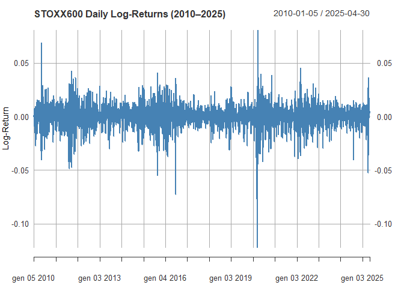
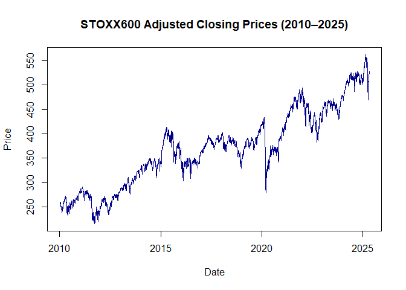
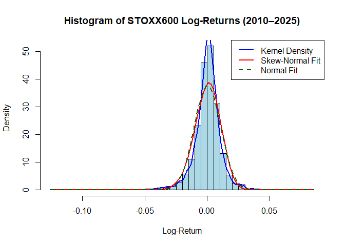
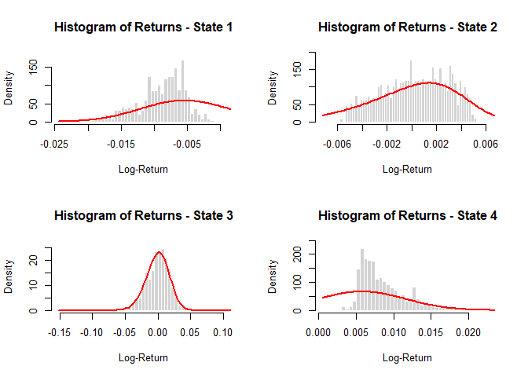
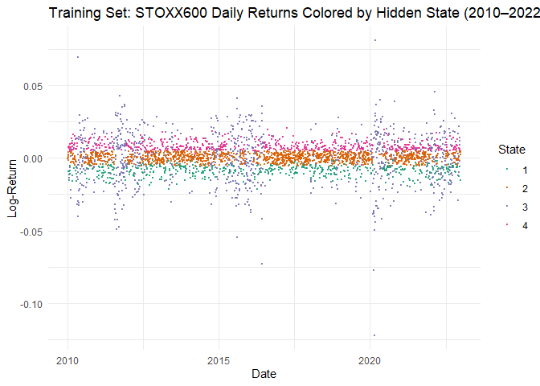
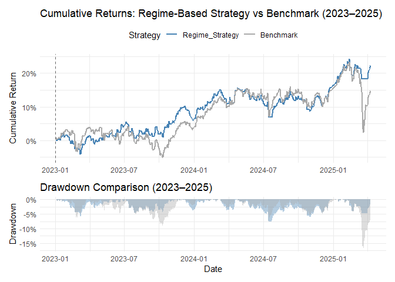

# Extending Hidden Markov Models with Skew-Normal Emissions: A Framework for Market Regime Identification and Trading

## Abstract

This project presents a regime-switching framework for modeling and
forecasting financial market dynamics, applying a Hidden Markov Model
(HMM) with skew-normal emission distributions to the daily returns of
the STOXX Europe 600 index over the period 2010–2025. By accommodating
both volatility clustering and asymmetric return distributions, the
model captures essential non-linear features of equity markets often
overlooked by standard Gaussian-based approaches.

Model selection, based on both Akaike (AIC) and Bayesian (BIC)
Information Criteria, identified a four-state specification as the most
parsimonious yet expressive structure. The estimated regimes exhibit
clearly differentiated statistical behavior: a persistent drawdown
regime with strongly negative returns (State 1), a moderately positive
but left-skewed environment (State 2), high-volatility rally phases
(State 3), and stable bullish trends (State 4).

Leveraging these insights, a regime-aware trading strategy was developed
by avoiding market exposure during high-risk states (1 and 3),
conditional on filtered state probabilities exceeding a 0.4 threshold.
Tested out-of-sample on the 2023–2025 period, the strategy yielded a
cumulative return of 22.38%, significantly outperforming the benchmark
(14.90%), with higher annualized returns (9.34% vs. 6.33%), a superior
Sharpe ratio (1.013 vs. 0.490), and a markedly lower maximum drawdown
(7.58% vs. 16.96%).

These results underscore the potential of regime-based filtering to
enhance risk-adjusted performance. While the approach already delivers
meaningful improvements over the benchmark, further refinements could
offer even greater robustness across changing market conditions.

------------------------------------------------------------------------

## 1. Introduction

## Introduction

Financial markets alternate between phases of stability, turbulence,
growth, and contraction. These regime shifts, while often driven by
macroeconomic trends, investor sentiment, or systemic shocks, are not
directly observable in asset return data. To uncover such latent
structure, Hidden Markov Models (HMMs) provide a powerful and flexible
framework for modeling unobservable market states and the probabilistic
transitions between them.

An HMM assumes that the observed time series—such as stock or index
returns—is generated by an underlying process that moves between a
finite set of hidden regimes. Each regime is characterized by a distinct
distribution of returns, while regime transitions follow a Markov
process, meaning that the probability of moving to the next state
depends only on the current one.

Traditionally, the regime-dependent distributions in HMMs have been
modeled using Gaussian densities. However, empirical financial returns
frequently exhibit skewness and fat tails, especially during periods of
elevated volatility or crisis. To address these stylized features, this
study extends the classical HMM by adopting **skew-normal emission
distributions**, allowing each regime to have its own location, scale,
and skewness parameters. This extension enables the model to better
capture asymmetric market behavior and extreme observations.

This work applies a Hidden Markov Model with skew-normal emissions to
the **daily returns of the STOXX Europe 600 index over the period
2010–2025**. The goals of the study are:

- To estimate HMMs with one to four regimes and select the best model
  using the Akaike and Bayesian Information Criteria;
- To interpret each identified regime in economic terms (e.g., crisis,
  stable bull, high-volatility recovery);
- To apply the selected model out-of-sample to the 2023–2025 period and
  build a regime-aware trading strategy;
- To dynamically adjust exposure by **excluding high-risk regimes**,
  based on filtered probabilities crossing regime-specific thresholds.

The model is implemented in R, using the `sn` package to handle
skew-normal distributions. The standard forward algorithm is modified
accordingly for likelihood evaluation and real-time filtering.

In summary, this project combines robust probabilistic modeling with a
practical regime-based trading application. It highlights how latent
state inference can support adaptive investment decisions and improve
risk management in the presence of nonlinear market dynamics.

------------------------------------------------------------------------

## 2. Background Theory

### 2.1 The Skew-Normal Distribution

The **skew-normal distribution** is a generalization of the normal
distribution that incorporates skewness. Introduced by Azzalini (1985),
it is particularly useful in modeling financial data that deviates from
symmetry, especially during periods of extreme market movement.

The probability density function (PDF) of a skew-normal distribution is
given by:

$$
f(x; \xi, \omega, \alpha) = \frac{2}{\omega} \, \phi\left(\frac{x - \xi}{\omega}\right) \, \Phi\left(\alpha \cdot \frac{x - \xi}{\omega}\right)
$$

Where:

- $\xi \in \mathbb{R}$ is the **location parameter** (analogous to the
  mean).

- $\omega > 0$ is the **scale parameter** (analogous to the standard
  deviation).

- $\alpha \in \mathbb{R}$ is the **skewness parameter** which determines
  the asymmetry of the distribution, indicating whether the data tend to
  have a longer tail on one side.

- $\phi(\cdot)$ is the standard normal density.

- $\Phi(\cdot)$ is the standard normal cumulative distribution function.

Some important properties:

1.  When $\alpha = 0$, the skew-normal reduces to the **standard normal
    distribution**.

2.  Positive $\alpha$ implies **right skewness**, and negative $\alpha$
    implies **left skewness**.

3.  The distribution can model **asymmetry** in asset returns, which is
    common in financial data.

The `sn` package in R is employed to work with the skew-normal
distribution, providing the function `dsn()` for evaluating the
corresponding probability density function.

### 2.2 Hidden Markov Models (HMMs)

Hidden Markov Models (HMMs) are powerful tools for modeling time series
that exhibit unobservable structural changes over time, such as shifts
in volatility or returns in financial markets. They describe a process
governed by a sequence of hidden states that influence the behavior of
observed data. The key idea is that the observed series is generated
from a set of regime-specific distributions, while the regimes
themselves evolve stochastically according to a Markov chain.

#### 2.2.1 Model structure

An HMM consists of two interconnected stochastic processes: a **hidden
state process** $\{C_t\}_{t=1}^T$, and an **observable process**
$\{X_t\}_{t=1}^T$. The hidden process takes values in a finite set of
$m$ regimes and follows a first-order, time-homogeneous Markov chain.
The observed process consists of real-valued variables, where each $X_t$
is conditionally independent of the past given the current hidden state
$C_t$.

This structure is illustrated below:

``` r
knitr::include_graphics("HMM.png")
```

<!-- -->

Formally, the model is defined by:

- A set of hidden states $C_t \in \{1, ..., m\}$;
- An initial distribution $\delta = (\delta_1, ..., \delta_m)$, where
  $\delta_j = P(C_1 = j)$;
- A transition matrix $\Gamma = (\gamma_{ij})$, where
  $\gamma_{ij} = P(C_t = j \mid C_{t-1} = i)$ and
  $\sum_{j=1}^m \gamma_{ij} = 1$ for all $i$;
- A set of emission densities $f_j(x)$, such that
  $X_t \mid C_t = j \sim f_j(x)$.

In our setting, each $f_j(x)$ is assumed to follow a **skew-normal
distribution** with:

- location parameter $\xi_j \in \mathbb{R}$,
- scale parameter $\omega_j > 0$,
- skewness parameter $\alpha_j \in \mathbb{R}$.

Under these assumptions, the **joint distribution** of the full sequence
of observations and hidden states can be factorized as:

$$
P(X_{1:T}, C_{1:T}) = \delta_{C_1} f_{C_1}(x_1) \prod_{t=2}^{T} \gamma_{C_{t-1}, C_t} f_{C_t}(x_t)
$$

#### 2.2.2 Forward algorithm and likelihood

To compute the likelihood of the observed data, summing over all
possible sequences of hidden states is computationally infeasible due to
exponential complexity in $T$. Instead, we use the **forward
algorithm**, which recursively computes the likelihood via **forward
probabilities**:

$$
\alpha_t(j) = P(X_{1:t}, C_t = j)
$$

This is interpreted as the joint probability of observing the data up to
time $t$ and being in state $j$ at time $t$.

The recursion is:

- **Initialization**: $$
  \alpha_1(j) = \delta_j \cdot f_j(x_1)
  $$

- **Induction** (for $t = 2, ..., T$): $$
  \alpha_t(j) = \sum_{i=1}^m \alpha_{t-1}(i) \cdot \gamma_{ij} \cdot f_j(x_t)
  $$

- **Termination (total likelihood)**: $$
  \mathcal{L}(\theta) = \sum_{j=1}^m \alpha_T(j), \quad \log \mathcal{L}(\theta) = \log\left( \sum_{j=1}^m \alpha_T(j) \right)
  $$

The emission densities $f_j(x_t)$ are evaluated using the `dsn()`
function from the `sn` package in R. The parameter vector
$\theta = (\Gamma, \xi_j, \omega_j, \alpha_j)$ is estimated by
maximizing the log-likelihood using the **L-BFGS-B** algorithm — a
constrained quasi-Newton optimization method suitable for large-scale
problems.

#### 2.2.3 Filtering and prediction

Once the forward probabilities are computed, the **filtered
probabilities**—the posterior distribution of the hidden state at time
$t$—can be derived by normalization:

$$
P(C_t = j \mid X_{1:t}) = \frac{\alpha_t(j)}{\sum_{k=1}^m \alpha_t(k)}
$$

These probabilities offer a real-time estimate of the system’s hidden
state and are used to detect and act on regime shifts in our trading
strategy.

We can also compute the **one-step-ahead predictive distribution** of
the next regime:

$$
P(C_{t+1} = j \mid X_{1:t}) = \sum_{i=1}^m P(C_t = i \mid X_{1:t}) \cdot \gamma_{ij}
$$

This predictive step gives the probability of transitioning to each
possible state at $t+1$, based on all current information.

#### 2.2.4 Remarks

Although the **EM algorithm** (e.g., Baum–Welch) is widely used for
estimating Hidden Markov Models with tractable emission distributions,
it is not applied in this project. The skew-normal distribution, while
flexible in capturing asymmetry, does not yield closed-form solutions
for the M-step updates required by EM. To address this, we estimate the
model parameters by directly maximizing the observed-data log-likelihood
using the L-BFGS-B optimization algorithm.

This direct likelihood approach enables simultaneous estimation of both
the transition matrix and regime-specific parameters, without relying on
intermediate expectation steps. Beyond its suitability for skew-normal
emissions, this method also offers greater flexibility for incorporating
more complex distributional assumptions, parameter constraints, or
regularization schemes—making it a robust framework for modeling latent
dynamics in financial time series.

------------------------------------------------------------------------

## 3. Data

### 3.1 Source and Description

The dataset under analysis consists of daily closing prices of the
**STOXX Europe 600 index**, a comprehensive benchmark comprising large,
mid, and small-capitalization companies from 17 European countries. The
observation period spans from **January 2015 to March 2025**. Data are
retrieved using the `get.hist.quote()` function from the `tseries`
package in R.

The `"AdjClose"` column is used to compute **daily log-returns**, which
are widely employed in financial time series modeling due to their
properties of additivity and approximate stationarity.

``` r
# Load required libraries
library(tseries)
library(xts)
library(sn) 
library(dplyr)
library(e1071) 
library(ggplot2)
library(ggthemes)
library(PerformanceAnalytics)
library(reshape2)
library(patchwork)
library(scales) 

# Download STOXX600 adjusted close prices from 2010 to early 2025
sx600 <- get.hist.quote(instrument = "^stoxx", 
                        start = "2010-01-01", 
                        end = "2025-05-01", 
                        quote = "AdjClose")
```

    ## time series starts 2010-01-04
    ## time series ends   2025-04-30

``` r
# Compute daily log-returns
sx600.num <- as.numeric(sx600)
sx600.ret <- diff(log(sx600.num))
dates <- index(sx600)[-1]
sx600.ret <- xts(sx600.ret, order.by = dates)
colnames(sx600.ret) <- "log_returns"
```

### 3.2 Data Inspection

A visual inspection of the data is conducted to identify potential
anomalies, missing values, or extreme outliers.

``` r
# Plot STOXX600 daily log-returns (2010–2025)
plot(sx600.ret, 
     main = "STOXX600 Daily Log-Returns (2010–2025)", 
     col = "steelblue", 
     ylab = "Log-Return", 
     xlab = "Date", 
     major.ticks = "years", 
     grid.ticks.on = "years")
```

<!-- -->

``` r
# Plot STOXX600 adjusted closing prices (2010–2025)
plot(sx600, 
     main = "STOXX600 Adjusted Closing Prices (2010–2025)", 
     col = "darkblue", 
     ylab = "Price", 
     xlab = "Date", 
     major.ticks = "years", 
     grid.ticks.on = "years")
```

<!-- -->

### 3.3 Observations

The time series plots of the STOXX Europe 600 index, presented in the
previous section, reveal clear patterns of changing dynamics over time.
Notably, the periods around early 2020 and mid-2022 exhibit marked
increases in volatility, likely corresponding to major macroeconomic
events such as the COVID-19 outbreak and subsequent inflationary shocks.
These episodes suggest the presence of structural breaks or underlying
regime shifts in the data-generating process. Additionally, the presence
of occasional large negative returns provides visual evidence of
asymmetry, particularly in the left tail of the distribution, consistent
with the notion of **negative skewness**.

These empirical features motivate the application of a **Hidden Markov
Model (HMM)** with **skew-normal emission distributions**, which allows
for both latent regime switching and the flexibility to model
non-symmetric return behavior. Before proceeding to model estimation, it
is essential to examine the unconditional distribution of returns and
compare its shape to the Gaussian and skew-normal assumptions.

``` r
# Extract full returns vector
returns <- na.omit(as.numeric(sx600.ret$log_returns))

# Plot histogram with density overlays
hist(returns,
     breaks = 50,
     freq = FALSE,
     col = "lightblue",
     main = "Histogram of STOXX600 Log-Returns (2010–2025)",
     xlab = "Log-Return")

# Kernel density
lines(density(returns), col = "blue", lwd = 2)

# Fit skew-normal distribution
fit_sn <- selm(returns ~ 1)
params <- coef(fit_sn, "DP")  # Extract xi, omega, alpha

# Overlay skew-normal density
curve(dsn(x, xi = params["xi"], omega = params["omega"], alpha = params["alpha"]),
      add = TRUE, col = "red", lwd = 2)

# Overlay normal density
curve(dnorm(x, mean = mean(returns), sd = sd(returns)),
      add = TRUE, col = "darkgreen", lwd = 2, lty = 2)

# Add legend
legend("topright",
       legend = c("Kernel Density", "Skew-Normal Fit", "Normal Fit"),
       col = c("blue", "red", "darkgreen"),
       lwd = 2, lty = c(1, 1, 2))
```

<!-- -->

``` r
# === Compute and compare skewness measures ===

# Extract skewness parameter (alpha)
alpha <- params["alpha"]

# Compute implied skewness from skew-normal fit
delta <- alpha / sqrt(1 + alpha^2)
skew_sn <- ((4 - pi) / 2) * ((delta * sqrt(2 / pi))^3) / ((1 - (2 * delta^2 / pi))^(3/2))

# Compute empirical skewness
empirical_skew <- skewness(returns)

# Display comparison
cat("Empirical skewness from data:       ", round(empirical_skew, 5), "\n")
```

    ## Empirical skewness from data:        -0.79483

``` r
cat("Skewness implied by skew-normal fit:", round(skew_sn, 5), "\n")
```

    ## Skewness implied by skew-normal fit: -0.22654

``` r
cat("Skewness parameter alpha:           ", round(alpha, 5), "\n")
```

    ## Skewness parameter alpha:            -1.27892

The distributional properties of the STOXX Europe 600 daily log-returns
are first explored using histogram-based visualizations and quantitative
skewness measures. In addition to the histogram, three overlaid density
curves are provided:

- A **kernel density estimate**, serving as a non-parametric benchmark;
- A **normal distribution fit**, assuming symmetry in returns;
- A **skew-normal distribution fit**, estimated via maximum likelihood
  using the `selm()` function from the `sn` package.

This setup allows for a visual and statistical comparison of how well
the skew-normal distribution captures the empirical features of the
data, particularly in terms of asymmetry and tail behavior.

The kernel density reveals a moderately left-skewed distribution with
heavier tails than the Gaussian fit. The skew-normal distribution
provides a visibly better fit than the normal, especially in the left
tail, but still does not fully capture the depth of asymmetry. This is
confirmed by numerical measures: the **empirical skewness** of the
returns is estimated at **−0.7948**, whereas the **skewness implied by
the fitted skew-normal distribution** is only **−0.2265**, based on a
skewness parameter of $\alpha = -1.2789$.

This discrepancy highlights a structural limitation of modeling the
entire return distribution with a single skew-normal component. While
the skew-normal improves upon the symmetric Gaussian assumption, it
still underestimates extreme tail risk and return asymmetry.

This observation motivates the adoption of a regime-switching framework,
where multiple market states — each with potentially different
volatility, mean, and skewness — are modeled separately. The next
section formalizes this approach through the introduction of a Hidden
Markov Model (HMM) with skew-normal emissions.

Before proceeding with the model estimation, the data is partitioned
into a **training set (2010–2022)** and a **test set (2023–2025)**. This
structure enables rigorous out-of-sample evaluation of both model fit
and trading strategy performance.

``` r
# Create train/test split
train_end <- as.Date("2022-12-31")
test_start <- as.Date("2023-01-01")

dates_full <- index(sx600.ret)
returns_full <- na.omit(as.numeric(sx600.ret$log_returns))

# Find date indices
train_idx <- which(dates_full <= train_end)
test_idx  <- which(dates_full >= test_start)

# Split returns
returns_train <- returns_full[train_idx]
returns_test  <- returns_full[test_idx]

# Also split dates (for plotting or xts conversion later)
dates_train <- dates_full[train_idx]
dates_test  <- dates_full[test_idx]
```

------------------------------------------------------------------------

## 4. HMM Model with Skew-Normal Distribution

### 4.1 Forward Algorithm with Skew-Normal Emissions

To compute the log-likelihood of a Hidden Markov Model (HMM) with
skew-normal emissions, the standard **Forward algorithm** is modified by
replacing the Gaussian density with a **skew-normal density function.**

The recursion for the forward probabilities is:

$$
\alpha_t(j) = \sum_{i=1}^m \alpha_{t-1}(i) \cdot \gamma_{ij} \cdot f_j(x_t)
$$

Where:

- $m$: number of hidden states

- $f_j(x_t)$ is the skew-normal PDF evaluated using:

$$
f_j(x_t) = \frac{2}{\omega_j} \, \phi\left(\frac{x_t - \xi_j}{\omega_j}\right) \, \Phi\left(\alpha_j \cdot \frac{x_t - \xi_j}{\omega_j}\right)
$$

The `dsn()` function from the `sn` package is used to evaluate the
skew-normal density within the modified Forward algorithm.

``` r
# Forward algorithm with skew-normal emission distributions
forward_skew <- function(delta, gamma, xi, omega, alpha, data) {
  m <- length(delta)
  T <- length(data)
  
  pred <- matrix(NA, nrow = m, ncol = T)
  filtering <- matrix(NA, nrow = m, ncol = T)
  
  pred[, 1] <- delta
  filtering[, 1] <- pred[, 1] * dsn(x = data[1], xi = xi, omega = omega, alpha = alpha)
  loglik <- log(sum(filtering[, 1]))
  filtering[, 1] <- filtering[, 1] / sum(filtering[, 1])
  
  for (t in 2:T) {
    pred[, t] <- as.vector(t(filtering[, t - 1]) %*% gamma)
    filtering[, t] <- pred[, t] * dsn(x = data[t], xi = xi, omega = omega, alpha = alpha)
    loglik <- loglik + log(sum(filtering[, t]))
    filtering[, t] <- filtering[, t] / sum(filtering[, t])
  }
  
  return(list(loglik = loglik, filtering = filtering, pred = pred))
}
```

### 4.2 Log-Likelihood Function

The total log-likelihood is computed using the normalizing constants
from the forward algorithm:

$$
\log L = \log \left( \sum_{j=1}^{m} \alpha_1(j) \right) + \sum_{t=2}^{T} \log \left( \sum_{j=1}^{m} \alpha_t(j) \right)
$$

The following function is used to evaluate the log-likelihood of the
observed data under a specified Hidden Markov Model with skew-normal
emissions. It performs the following operations:

- Constructs the transition probability matrix $\Gamma$ from the
  flattened parameter vector.
- Extracts the skew-normal parameters $(\xi_j, \omega_j, \alpha_j)$ for
  each hidden state.
- Computes the stationary distribution $\delta$ associated with
  $\Gamma$.
- Calls the `forward_skew()` function to compute the overall
  log-likelihood of the model.

``` r
loglik_skewHMM <- function(par, m, data) {
  # Transition matrix
  gamma <- matrix(par[1:(m^2)], nrow = m, byrow = TRUE)
  gamma <- gamma / rowSums(gamma)  # normalize rows
  
  # Skew-normal parameters
  start <- m^2 + 1
  xi <- par[start:(start + m - 1)]
  omega <- par[(start + m):(start + 2 * m - 1)]
  alpha <- par[(start + 2 * m):(start + 3 * m - 1)]
  
  # Stationary distribution
  I <- diag(m)
  U <- matrix(1, m, m)
  delta <- solve(t(I - gamma + U), rep(1, m))
  
  out <- forward_skew(delta, gamma, xi, omega, alpha, data)
  return(out$loglik)
}
```

### 4.3 Parameter Structure

For a model with $m$ hidden states, the total number of parameters $k$
is:

$$
k =m^2 +3m
$$

- $m^2$ transition probabilities (flattened into a vector, then
  normalized).

- $m$ location parameters $\xi$.

- $m$ scale parameters $\omega$.

- $m$ skewness parameters $\alpha$.

These parameters are combined into a single vector and passed to the
optimization routine. Bounds are applied to ensure $\omega_j > 0$
(positive scale), while $\xi_j$ and $\alpha_j$ are unconstrained.

In the subsequent chapter, this function is incorporated within the
`optim()` optimization routine to estimate model parameters for varying
numbers of hidden states ($m$). For each specification, both the
**Akaike Information Criterion (AIC)** and the **Bayesian Information
Criterion (BIC)** are computed to identify the model that best balances
goodness of fit and model complexity.

------------------------------------------------------------------------

## 5. Model Estimation

### 5.1 Overview

To determine the most appropriate number of hidden regimes, Hidden
Markov Models with skew-normal emissions are estimated for different
values of $m$, ranging from 1 to 4 hidden states. For each
specification, the log-likelihood is maximized using the `optim()`
function in R.

Model selection is conducted using both the **Akaike Information
Criterion (AIC)** and the **Bayesian Information Criterion (BIC)**,
which provide a trade-off between model fit and complexity. These are
computed as follows:

$$
\text{AIC} = 2k - 2 \log L
$$

$$
\text{BIC} = \log(T) \cdot k - 2 \log L
$$

where $k$ denotes the total number of estimated parameters, $\log L$ is
the maximized log-likelihood of the model, and $T$ is the sample size.

AIC tends to favor more flexible models, while BIC penalizes complexity
more heavily, often leading to more parsimonious model selection. Both
criteria are reported to guide the evaluation of model performance.

### 5.2 Parameter Estimation via Maximum Likelihood

Each model is estimated using the `optim()` function with the
`"L-BFGS-B"` optimization method, which allows for the imposition of box
constraints to ensure the positivity of the scale parameters.

``` r
# Set training data
data <- returns_train
T <- length(data)

fit_models <- list()
aic_bic_results <- data.frame()

# === Case m = 1: single skew-normal (no HMM) ===
cat("Fitting model with 1 state (no regime switching)...\n")
```

    ## Fitting model with 1 state (no regime switching)...

``` r
loglik_m1 <- function(par, data) {
  xi <- par[1]
  omega <- par[2]
  alpha <- par[3]
  -sum(dsn(data, xi = xi, omega = omega, alpha = alpha, log = TRUE))  # negative log-likelihood
}

init_par1 <- c(mean(data), sd(data), 0)
lower_bounds1 <- c(-Inf, 1e-4, -Inf)
upper_bounds1 <- c(Inf, Inf, Inf)

fit1 <- optim(
  par = init_par1,
  fn = loglik_m1,
  data = data,
  method = "L-BFGS-B",
  lower = lower_bounds1,
  upper = upper_bounds1
)

loglik1 <- -fit1$value
num_params1 <- 3
aic1 <- 2 * num_params1 - 2 * loglik1
bic1 <- log(T) * num_params1 - 2 * loglik1

aic_bic_results <- rbind(
  aic_bic_results,
  data.frame(States = 1, LogLikelihood = loglik1, NumParameters = num_params1, AIC = aic1, BIC = bic1)
)

fit_models[["HMM_1_state"]] <- list(
  par = fit1$par,
  loglik = loglik1,
  AIC = aic1,
  BIC = bic1,
  m = 1
)

# === Fit HMMs for m = 2 to 4 on training set ===
for (m in 2:4) {
  cat("Fitting model with", m, "states...\n")
  set.seed(123)
  
  k <- m^2 + 3 * m
  
  gamma_init <- rep(1 / m, m^2)
  xi_init <- rnorm(m, mean = 0, sd = 0.01)
  omega_init <- runif(m, 0.005, 0.05)
  alpha_init <- rnorm(m, 0, 2)
  
  init_par <- c(gamma_init, xi_init, omega_init, alpha_init)
  
  lower_bounds <- c(rep(1e-6, m^2), rep(-Inf, m), rep(1e-4, m), rep(-Inf, m))
  upper_bounds <- c(rep(1, m^2), rep(Inf, m), rep(Inf, m), rep(Inf, m))
  
  fit <- optim(
    par = init_par,
    fn = function(par) -loglik_skewHMM(par, m, data),
    method = "L-BFGS-B",
    lower = lower_bounds,
    upper = upper_bounds,
    control = list(maxit = 1000)
  )
  
  loglik <- -fit$value
  num_params <- m^2 + 3 * m
  aic <- 2 * num_params - 2 * loglik
  bic <- log(T) * num_params - 2 * loglik
  
  aic_bic_results <- rbind(aic_bic_results, data.frame(
    States = m,
    LogLikelihood = loglik,
    NumParameters = num_params,
    AIC = aic,
    BIC = bic
  ))
  
  fit_models[[paste0("HMM_", m, "_states")]] <- list(
    par = fit$par,
    loglik = loglik,
    AIC = aic,
    BIC = bic,
    m = m
  )
}
```

    ## Fitting model with 2 states...
    ## Fitting model with 3 states...
    ## Fitting model with 4 states...

### 5.3 AIC / BIC Comparison and Model Selection

Model selection is guided by a balance between goodness of fit and
parsimony, using the **Akaike Information Criterion (AIC)** and the
**Bayesian Information Criterion (BIC)**. The results are summarized in
the table below.

``` r
# View results
print(aic_bic_results)
```

    ##   States LogLikelihood NumParameters       AIC       BIC
    ## 1      1      10127.44             3 -20248.89 -20230.61
    ## 2      2      10408.36            10 -20796.72 -20735.80
    ## 3      3      10436.29            18 -20836.59 -20726.93
    ## 4      4      10631.68            28 -21207.35 -21036.77

Both the Akaike Information Criterion (AIC) and the Bayesian Information
Criterion (BIC) clearly favor the **4-state Hidden Markov Model**, which
achieves the lowest AIC (**−21207.35**) and lowest BIC (**−21036.77**)
among all specifications considered. These results indicate that the
4-state model provides the most statistically appropriate representation
of the data, balancing model complexity and fit.

For this reason, the 4-state Hidden Markov Model with skew-normal
emissions is selected for further analysis.

The next section focuses on interpreting this model: extracting the
regime-specific parameters, analyzing the inferred state sequence, and
visualizing the evolution of filtered regime probabilities over time.
Each latent state is then linked to characteristic patterns in market
behavior, forming the foundation for a regime-aware investment strategy
evaluated in the final part of the study.

------------------------------------------------------------------------

## 6. Interpretation of regimes

### 6.1 Extracting Parameters from the Best Model

Following the Akaike Information Criterion (AIC) analysis presented in
the previous chapter, the Hidden Markov Model (HMM) with **four latent
states** was selected as the most appropriate specification. This
section provides a detailed interpretation of the model’s output by
examining the estimated parameters for each hidden regime.

The key parameters extracted from the best-fitting model include:

- **Location** $(\xi)$: Represents the average log-return associated
  with each state.

- **Scale** $(\omega)$: Reflects the volatility or dispersion of returns
  in each regime.

- **Skewness** $(\alpha)$: Captures the asymmetry of the return
  distribution, indicating whether the tails are heavier on the left or
  right.

- **Transition matrix** $(\Gamma)$: Describes the probabilities of
  transitioning between the four hidden states.

- **Stationary distribution** $(\delta)$: Provides the long-run
  equilibrium probabilities of remaining in each regime, regardless of
  the initial state.

These parameters allow for a nuanced understanding of the statistical
characteristics that define each latent market condition.

``` r
# Extract the 4-state model fitted on training data
best_model <- fit_models[["HMM_4_states"]]
par <- best_model$par
m <- best_model$m  # Should be 4

# Unpack transition matrix and emission parameters
gamma_vec <- par[1:(m^2)]
gamma <- matrix(gamma_vec, nrow = m, byrow = TRUE)
gamma <- gamma / rowSums(gamma)  # Ensure rows sum to 1

start <- m^2 + 1
xi <- par[start:(start + m - 1)]
omega <- par[(start + m):(start + 2 * m - 1)]
alpha <- par[(start + 2 * m):(start + 3 * m - 1)]

# Compute stationary distribution (solves: δᵗΓ = δᵗ)
I <- diag(m)
U <- matrix(1, m, m)
delta <- solve(t(I - gamma + U), rep(1, m))

# Display parameters in a table
parameter_table <- data.frame(
  State = 1:m,
  Location = xi,
  Scale = omega,
  Skewness = alpha,
  Stationary_Prob = delta
)

print(parameter_table)
```

    ##   State     Location       Scale   Skewness Stationary_Prob
    ## 1     1 -0.009473356 0.008155872  0.9238561       0.1977811
    ## 2     2  0.004237474 0.005690970 -2.5261423       0.2519259
    ## 3     3  0.014067383 0.022855214 -1.3765333       0.3308619
    ## 4     4  0.009220455 0.007078518 -0.8912309       0.2194312

The table above summarizes the estimated parameters for each of the four
hidden states in terms of location (mean), scale (volatility), skewness,
and stationary probability.

The variation in location and scale parameters suggests that the model
successfully identifies regimes with differing return levels and
volatility. For example, some states are associated with negative
average returns and higher dispersion, while others reflect more stable
or positive performance patterns.

The inclusion of skewness provides additional depth, capturing the
asymmetry in return distributions across regimes—potentially signaling
fear-driven selloffs or right-tailed momentum behavior. Finally, the
stationary probabilities offer insight into the relative persistence of
each regime, indicating how frequently and for how long the market tends
to reside in each state.

These distinctions will be explored in more detail in the following
subsection, where each regime is linked to observable patterns in the
return series and economic interpretations are proposed.

``` r
# Run forward algorithm once using the full data and fitted model
forward_results <- forward_skew(delta, gamma, xi, omega, alpha, returns_full)
filtering <- forward_results$filtering  
most_likely_states <- apply(filtering, 2, which.max)

# Plot histograms by state using only training data
par(mfrow = c(2, 2))  # 2x2 grid for 4 states

for (state in 1:4) {
  # Filter: only training period & only current state
  data_state <- returns_train[most_likely_states[train_idx] == state]
  
  if (length(data_state) == 0) {
    plot.new()
    title(main = paste("No data for State", state))
    next
  }

  hist_info <- hist(data_state, probability = TRUE, breaks = 50, plot = FALSE)

  data_min <- min(data_state)
  data_max <- max(data_state)
  range_expansion <- (data_max - data_min) * 0.15

  x_min <- data_min - range_expansion
  x_max <- data_max + range_expansion
  x_vals <- seq(x_min, x_max, length.out = 500)
  y_vals <- dsn(x_vals, xi = xi[state], omega = omega[state], alpha = alpha[state])

  ylim_max <- max(max(hist_info$density), max(y_vals)) * 1.1

  hist(data_state, probability = TRUE, breaks = 50,
       main = paste("Histogram of Returns - State", state),
       xlab = "Log-Return", ylab = "Density",
       col = "lightgray", border = "white",
       xlim = c(x_min, x_max), ylim = c(0, ylim_max))

  curve(dsn(x, xi = xi[state], omega = omega[state], alpha = alpha[state]),
        from = x_min, to = x_max, add = TRUE, col = "red", lwd = 2)
}
```

<!-- -->

The histograms of log-returns for each latent regime, overlaid with
their corresponding skew-normal density estimates, offer clear visual
validation of the model’s capability to capture distinct
return-generating processes. Across all four states, the fitted
distributions closely align with the observed data, successfully
reproducing both **dispersion** and **asymmetry**.

- **State 1** displays a moderately dispersed distribution with mild
  right skewness. The skew-normal curve overlays the histogram almost
  perfectly, indicating consistency between the estimated parameters and
  the empirical distribution.

- **State 2** is characterized by a tight, low-volatility profile with a
  slight negative skew, which is well captured by the fitted
  distribution. There is no apparent mismatch between the histogram and
  the model, suggesting that both **central tendency** and **tail
  behavior** are accurately estimated.

- **State 3** shows the broadest distribution among all regimes, with
  high variance and heavier tails. The skew-normal fit captures the
  shape convincingly, including the slight left skew, and matches the
  histogram’s bulk and tails.

- **State 4** is defined by positive mean returns and mild negative
  skewness. Again, the skew-normal density curve follows the empirical
  distribution closely, highlighting the regime’s **moderate
  volatility** and **asymmetric return profile**.

The close alignment between the histograms and the fitted skew-normal
curves confirms the model’s effectiveness in capturing both **central
tendencies** and **tail behaviors** of each regime. Some divergence is
to be expected, as each histogram reflects hard state assignments that
may not perfectly match the probabilistic nature of the model. In
addition, sampling variability—especially in less populated regimes—can
contribute to small mismatches between the empirical and fitted
distributions. This supports the conclusion that the chosen
specification — featuring skew-normal emissions and four latent states —
provides a robust and interpretable representation of the return
dynamics in the training data. The visual fit reinforces the
**statistical validity** of the model and highlights its capacity to
distinguish between distinct market phases.

### 6.2 Most Likely States Over Time

The **most likely regime at each point in time** is identified by
decoding the hidden states using the forward probabilities obtained from
the modified forward algorithm. This procedure enables the assignment of
each observation $t$ to its most probable underlying state, thereby
providing a time-varying sequence of regime classifications.

Visualizing the inferred states alongside the daily returns of the STOXX
Europe 600 index offers insights into the temporal dynamics of the
latent regimes. This step is essential for detecting structural changes
in market behavior, relating estimated regimes to historical financial
events, and laying the groundwork for practical applications such as
regime-based trading strategies.

``` r
## Plot regimes over time (training set only)

# Step 1: Extract training states and dates
dates_train <- dates_full[train_idx]
states_train <- most_likely_states[train_idx]
returns_train_plot <- returns_train  # already aligned with dates_train

# Step 2: Build data frame for ggplot
plot_data_train <- data.frame(
  Date = dates_train,
  Return = returns_train_plot,
  State = factor(states_train, levels = 1:4)  # Only 4 states
)

# Step 3: Plot
ggplot(plot_data_train, aes(x = Date, y = Return, color = State)) +
  geom_point(size = 0.5, alpha = 0.8) +
  scale_color_brewer(palette = "Dark2") +
  labs(title = "Training Set: STOXX600 Daily Returns Colored by Hidden State (2010–2022)",
       y = "Log-Return",
       x = "Date") +
  theme_minimal()
```

<!-- -->

### 6.3 Interpretation of Regimes

The four latent states estimated by the skew-normal Hidden Markov Model
correspond to distinct and interpretable market conditions. By analyzing
their location (mean), scale (volatility), and skewness, we can classify
each regime along both return and risk dimensions:

- **State 1 – Stressed Regime with Frequent Losses**

  This regime has a **negative average return** of `−0.0095`,
  **relatively high volatility** (`0.0082`), and **positive skewness**
  (`+0.92`). Although right-skewed, the combination of low returns and
  high dispersion suggests a **challenging market phase**, likely
  characterized by frequent small losses and occasional recoveries. It
  accounts for roughly **19.8%** of the time, indicating persistent but
  not dominant occurrence. This regime is generally undesirable for
  long-only strategies.

- **State 2 – Calm with Hidden Tail Risk**

  With a **moderate mean return** (`+0.0042`), **low volatility**
  (`0.0057`), and **extremely negative skewness** (`−2.53`), this state
  appears stable on the surface but harbors **pronounced downside tail
  risk**. The sharp negative asymmetry implies vulnerability to rare but
  severe drops. Despite its calm appearance, this regime may reflect
  **latent systemic fragility**. It is fairly persistent, occurring
  about **25.2%** of the time.

- **State 3 – Volatile Expansion with Crash Risk**

  This state shows the **highest average return** (`+0.0141`) but also
  the **largest volatility** (`0.0229`) and **significant negative
  skewness** (`−1.38`). It likely corresponds to **risky bull markets or
  crisis rebounds**, where substantial gains are possible but paired
  with high instability and crash potential. With a **33.1%** stationary
  probability, this is the **most common regime**, capturing speculative
  or transitional market phases.

- **State 4 – Stable Growth with Mild Downside**

  Characterized by a **moderately high return** (`+0.0092`), **lower
  volatility** (`0.0071`), and **mild negative skew** (`−0.89`), this
  regime reflects a **controlled bullish environment**. While not as
  explosive as State 3, it offers **favorable conditions with limited
  downside risk**, making it ideal for sustained exposure. It occurs
  about **21.9%** of the time, representing a stable but not dominant
  regime.

Together, these four regimes offer a **nuanced segmentation of market
behavior**:

- **State 1**: Persistent Stress — Frequent Losses, High Variance
- **State 2**: Hidden Fragility — Calm with Extreme Left Tails
- **State 3**: Boom-Bust Dynamics — High Returns, High Risk
- **State 4**: Controlled Bull — Moderate Gains, Contained Risk

This decomposition provides a **robust foundation for regime-aware
portfolio construction**, allowing for **selective participation** in
favorable states and **risk mitigation** in adverse ones.

## 7. Strategy Based on Regimes

### 7.1 Defining a Regime-Aware Trading Rule

Based on the regime interpretation developed in Chapter 6, we now
construct a regime-aware trading strategy that leverages the filtering
probabilities estimated by the Hidden Markov Model with skew-normal
emissions. In this setup, the allocation to the market is dynamically
adjusted according to the inferred likelihood of being in specific
latent regimes.

Among the four detected regimes, **State 1** and **State 3** are
excluded from exposure due to their adverse risk-return profiles:

- **State 1**: Despite low volatility, it is associated with a negative
  average return and strong positive skewness. This configuration
  suggests a stagnating or slightly bearish environment with infrequent
  but large upside outliers. However, the negative drift makes it
  unattractive from a mean-variance perspective.

- **State 3**: Displays the highest volatility among all regimes and
  also features a high average return, but with significant left
  skewness. This implies that while short-term gains may occur, the
  regime is prone to sharp downturns or crash-like behavior. Even if
  exiting before or during such phases is challenging in practice,
  avoiding exposure in this regime allows the strategy to focus on
  capital preservation. By doing so, it prioritizes downside protection
  over potentially erratic gains. Such a regime is typical of highly
  unstable speculative environments or early-crisis phases.

In contrast, **State 2** and **State 4** are retained in the portfolio.
While **State 2** does exhibit negative skewness, it combines this with
low volatility and a moderate positive return, resulting in a stable,
risk-adjusted environment that does not warrant exclusion. **State 4**
offers one of the highest average returns and maintains moderate risk
levels, making it an attractive regime to remain invested. Together,
these states represent a balanced trade-off between return and
controlled risk.

The trading rule is implemented as follows:

- If the **filtered probability** of either **State 1** or **State 3**
  exceeds a predefined threshold (set at 40%), the strategy **exits the
  market** (i.e., position = 0).
- Otherwise, the strategy **remains fully invested** (i.e., position =
  1).

This rule is updated **daily** using the one-step-ahead filtering
probabilities derived from the model. The choice of a binary (0/1)
allocation simplifies interpretation and execution, while the 40%
threshold ensures a sufficient level of regime confidence before
altering exposure.

By excluding only the riskier regimes and staying invested during
statistically favorable states, this strategy aims to preserve
participation in upward trends while avoiding periods of systemic stress
or poor expected returns. Importantly, this version of the trading rule
is tested **out-of-sample** on the 2023–2025 data subset, using model
parameters estimated on the 2010–2022 training period.

``` r
# Step 0: Use filtering probabilities
posterior_probs <- filtering  # dimensions: m × T

# Step 1: Lag posterior probabilities across time
posterior_probs_lagged <- posterior_probs[, -ncol(posterior_probs)]
posterior_probs_lagged <- cbind(rep(NA, nrow(posterior_probs)), posterior_probs_lagged)
colnames(posterior_probs_lagged) <- colnames(posterior_probs)

# Step 2: Risky states and thresholds
thresholds <- c("1" = 0.4, "3" = 0.4)

# Step 3: Define valid test index range
max_t <- ncol(posterior_probs_lagged)
adjusted_test_idx <- test_idx[test_idx <= max_t]  # prevent out-of-bounds error

# Step 4: Generate exit signals
exit_signal <- sapply(adjusted_test_idx, function(t) {
  any(posterior_probs_lagged[as.numeric(names(thresholds)), t] > thresholds)
})
signal_test <- ifelse(exit_signal, 0, 1)

# Step 5: Align test returns/dates
returns_test <- returns_full[adjusted_test_idx]
dates_test <- dates_full[adjusted_test_idx]

# Step 6: Compute strategy and benchmark
strategy_returns_test <- signal_test * returns_test
strategy_xts <- xts(strategy_returns_test, order.by = dates_test)
benchmark_xts <- xts(returns_test, order.by = dates_test)
```

### 7.2 Strategy Performance Evaluation

The performance of the regime-based trading strategy is evaluated in
comparison to a passive buy-and-hold benchmark.

The following performance metrics are used:

- **Cumulative return**
- **Annualized return**
- **Annualized volatility**
- **Sharpe Ratio** (with risk-free rate assumed to be 0%)
- **Maximum drawdown**

These indicators allow for a comprehensive assessment of the strategy’s
effectiveness in enhancing the overall risk-return profile. In
particular, they are used to examine whether the strategy is able to
improve performance by avoiding exposure during periods characterized by
elevated volatility and downside risk, as identified by the Hidden
Markov Model.

``` r
# Combine strategy and benchmark returns into a single xts object
returns_df <- na.omit(merge(strategy_xts, benchmark_xts))
colnames(returns_df) <- c("Regime_Strategy", "Benchmark")

# === Cumulative returns
cum_returns <- cumprod(1 + returns_df) - 1
cum_returns_df <- fortify.zoo(cum_returns, name = "Date")
cum_returns_df <- melt(cum_returns_df, id.vars = "Date")

# === Drawdowns
drawdowns <- PerformanceAnalytics::Drawdowns(returns_df)
drawdowns_df <- fortify.zoo(drawdowns, name = "Date")
drawdowns_df <- melt(drawdowns_df, id.vars = "Date")
```

``` r
library(scales)  

# Plot 1: Cumulative returns
p1 <- ggplot(cum_returns_df, aes(x = Date, y = value, color = variable)) +
  geom_line(size = 0.8) +
  geom_vline(xintercept = as.Date("2023-01-01"), linetype = "dashed", color = "gray40") +
  labs(
    title = "Cumulative Returns: Regime-Based Strategy vs Benchmark (2023–2025)",
    y = "Cumulative Return",
    x = NULL,
    color = "Strategy"
  ) +
  scale_color_manual(values = c("Regime_Strategy" = "steelblue", "Benchmark" = "darkgray")) +
  scale_y_continuous(labels = percent_format(accuracy = 1)) +
  theme_minimal() +
  theme(legend.position = "top")

# Plot 2: Drawdowns
p2 <- ggplot(drawdowns_df, aes(x = Date, y = value, fill = variable)) +
  geom_area(position = "identity", alpha = 0.4) +
  labs(
    title = "Drawdown Comparison (2023–2025)",
    y = "Drawdown",
    x = "Date",
    fill = "Strategy"
  ) +
  scale_fill_manual(values = c("Regime_Strategy" = "steelblue", "Benchmark" = "darkgray")) +
  scale_y_continuous(labels = percent_format(accuracy = 1)) +
  theme_minimal() +
  theme(legend.position = "none")

# Combine plots using patchwork
p1 / p2 + plot_layout(heights = c(2, 1))
```

<!-- -->

``` r
# Ensure column names
colnames(returns_df) <- c("Regime_Strategy", "Benchmark")

# 1. Cumulative return
cum_returns <- cumprod(1 + returns_df) - 1
final_cum_return <- round(as.numeric(tail(cum_returns, 1)), 4)

# 2. Annualized performance
annual_stats <- round(table.AnnualizedReturns(returns_df), 4)

# 3. Max drawdown
drawdowns <- round(maxDrawdown(returns_df), 4)

# 4. Combine all in one table
performance_summary <- data.frame(
  Metric = c(
    "Cumulative Return",
    "Annualized Return",
    "Annualized Volatility",
    "Sharpe Ratio (Rf=0%)",
    "Maximum Drawdown"
  ),
  Regime_Strategy = c(
    final_cum_return[1],
    annual_stats[1, "Regime_Strategy"],
    annual_stats[2, "Regime_Strategy"],
    annual_stats[3, "Regime_Strategy"],
    drawdowns[1]
  ),
  Benchmark = c(
    final_cum_return[2],
    annual_stats[1, "Benchmark"],
    annual_stats[2, "Benchmark"],
    annual_stats[3, "Benchmark"],
    drawdowns[2]
  )
)

# View table
print(performance_summary)
```

    ##                  Metric Regime_Strategy Benchmark
    ## 1     Cumulative Return          0.2238    0.1490
    ## 2     Annualized Return          0.0934    0.0633
    ## 3 Annualized Volatility          0.0922    0.1292
    ## 4  Sharpe Ratio (Rf=0%)          1.0129    0.4901
    ## 5      Maximum Drawdown          0.0758    0.1696

### 7.3 Discussion of Results

This section evaluates the out-of-sample performance of the regime-aware
trading strategy developed in Chapter 7.1. Applied to the 2023–2025 test
period, the strategy achieves a notable improvement across all key
performance indicators relative to the benchmark:

- **Cumulative and annualized returns** both increase substantially,
  indicating that the strategy remains successfully invested during
  periods of upward momentum while avoiding major drawdowns during
  turbulent phases.

- **Annualized volatility** declines markedly, resulting in a Sharpe
  ratio that more than doubles that of the benchmark.

- **Maximum drawdown** is reduced by over 50%, confirming the strategy’s
  ability to limit large losses by systematically exiting high-risk
  regimes.

These improvements are visually evident in the cumulative return plot.
For most of the test period, the strategy consistently outperforms the
benchmark, with both lines following similar upward trends. However, the
true performance divergence emerges near the end of the horizon, where
the benchmark suffers a sharp drop. The strategy, by contrast, flattens
and preserves gains. This separation is largely attributable to the
model’s ability to identify and avoid entry into **State 3**—a regime
characterized by high volatility and strong left-tail risk. Notably,
this late downturn aligns with a market reaction to renewed trade
tensions and tariffs under the Trump administration.

The model, trained on prior crisis periods such as the COVID-19 shock,
learns to associate similar statistical conditions with elevated
downside risk. As a result, it triggers timely disengagement from the
market ahead of the crash. This reinforces the decision to exclude State
3 from exposure, highlighting the practical value of informed regime
interpretation in real-world scenarios.

These findings validate the core hypothesis: latent regime
identification via HMMs can enhance risk-adjusted performance when
combined with robust interpretation of the underlying statistical
structure. Avoiding regimes with undesirable profiles—such as negative
drift, excess volatility, or asymmetric tail risk—proves effective in
improving both absolute and relative returns.

While encouraging, these results also suggest several avenues for future
refinement:

- **Threshold calibration**: The fixed 40% threshold could be adapted
  dynamically based on recent volatility or regime transition
  probabilities.
- **Soft allocation**: Instead of binary (0/1) decisions, exposure could
  be scaled proportionally to posterior probabilities to better reflect
  uncertainty.
- **Rolling re-estimation**: Using walk-forward or rolling windows would
  improve responsiveness to structural market changes.
- **Integration of additional signals**: Combining regime probabilities
  with volatility indicators or macroeconomic triggers may reduce false
  positives and improve exit timing.

In summary, the results confirm the practical relevance of probabilistic
regime modeling for portfolio management. The use of skew-normal HMMs
offers a flexible, data-driven framework for dynamically managing
exposure in complex markets. Most importantly, the ability to translate
latent regime inference into tangible outperformance—particularly
through timely risk avoidance—marks a promising step toward more robust,
risk-sensitive investment strategies.
